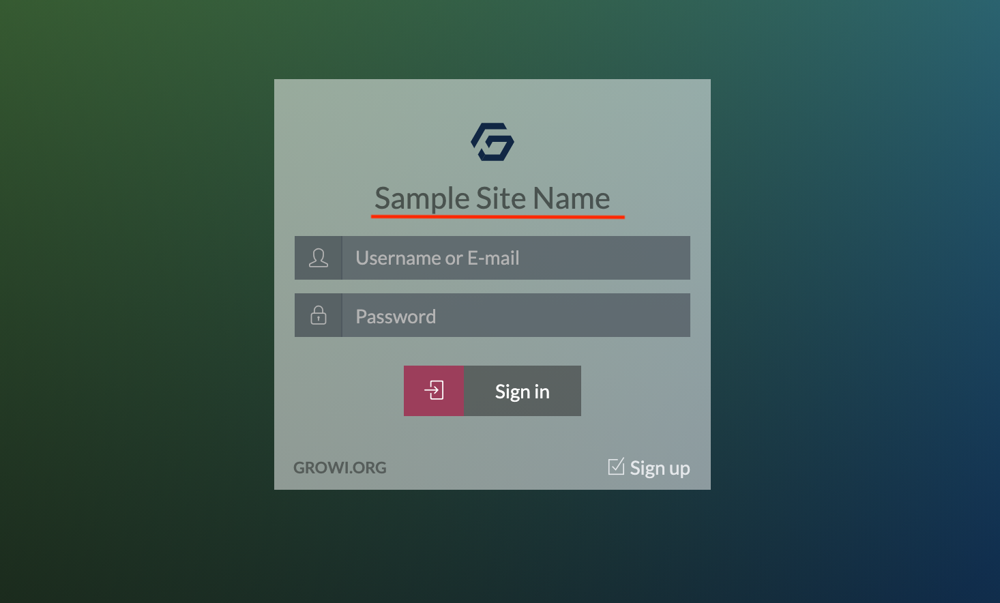
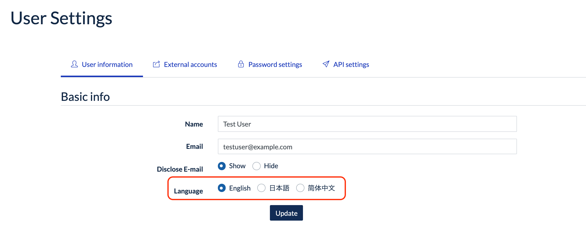
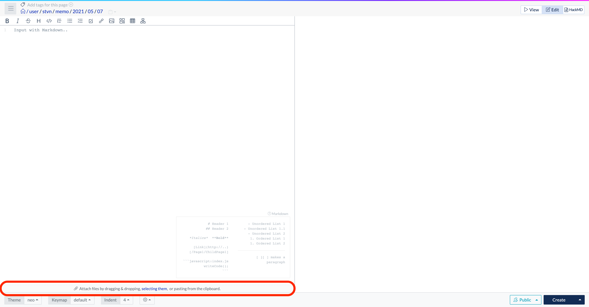
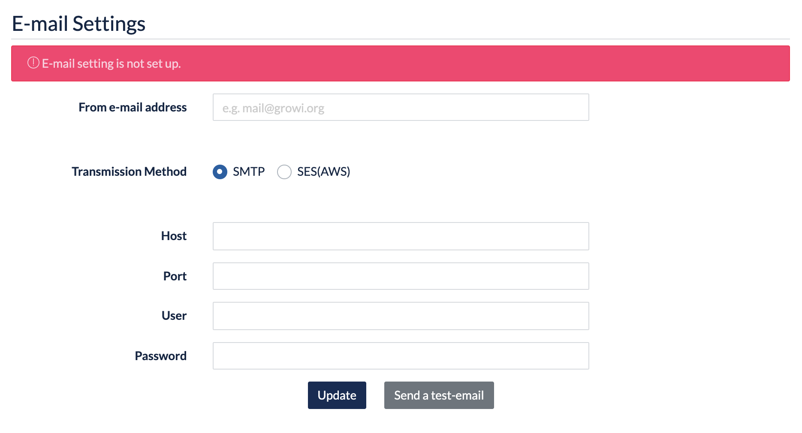
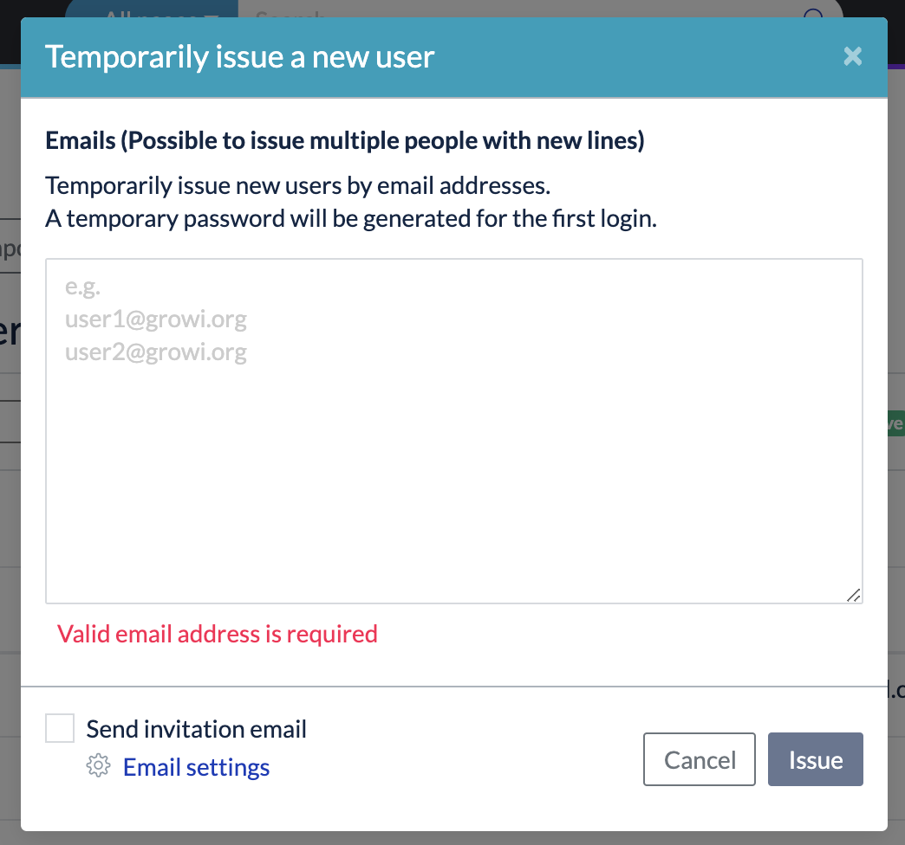
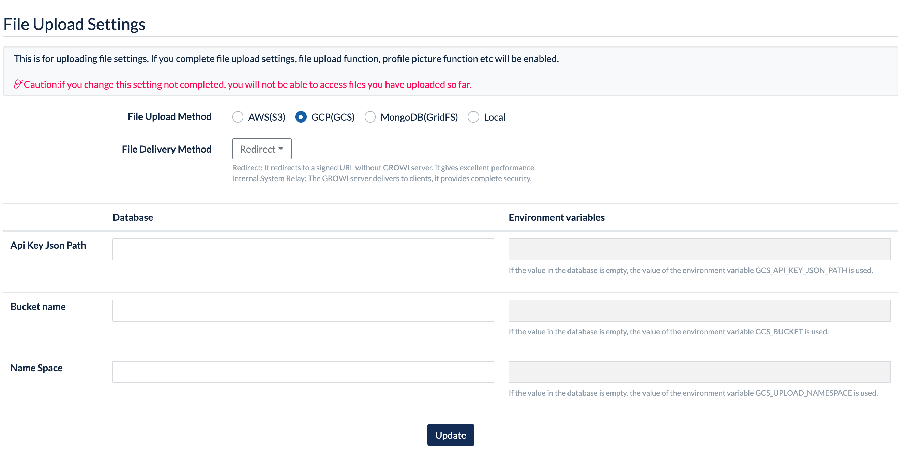

# App Settings

[[toc]]

## Site URL Settings

In this field, a URL could be set for GROWI.

**Make sure to set the Site URL setting for GROWI.**

:::warning
If the site URL is not set, some of the functions on GROWI will not work properly.
:::

If a DNS record such as `growi.example.com` has been specified as the destination for a custom domain, set it here.  
If a domain is not set to DNS, set the value to any URL.


If the environment variable `APP_SITE_URL` is set, the value will be displayed in the `Environment variables` column on the right.  


If a value is entered in the `Database` field, the value set in the `Database` field will take precedence over the `Environment variables` field.  

:::warning
If the site URL is not set, an error message will be displayed because some of the functions of GROWI will not work properly.

The following error message is displayed in the settings section of the admin page and in the header section of the page.  
Please be sure to set the **Site URL setting for GROWI**.


:::


## App Settings

### Site Name

If the site name is set, it is displayed on the login screen and the title of GROWI.




### Confidential Name

The contents set as the Confidential Name will be displayed in the GROWI header.


### Default language setting for new users

In this field, the user can select English, Japanese, or Chinese.


The above setting changes the default language when creating a new user in GROWI.




### File Uploading

GROWI has a setting that allows uploading of files other than images to a page.


If this option is unchecked, users will not be able to upload non-image files when editing the wiki page.

The File Uploading settings will enable users to upload files.



If the upload banner is hidden as following, the File Uploading settings have not been configured.


## Email settings

Sending e-mail from GROWI can be enabled by configuring one of the following configuration patterns:

  1. Setting up an SMTP server
  2. Using SES from AWS



If there is an alert that says **"E-mail setting is not set up"**, this indicates that the configuration form has not been fully completed.

### Notes on using SES

GROWI does not allow changing the Region and will attempt to send using us-east-1.  
If region other than us-east-1 is used, consider setting up SMTP on GROWI using the information on SES.

### Sending a test mail (on SMTP only)

When using an SMTP server, it is possible to send a test email to verify that the email settings are working.

After updating the SMTP server settings, press the **Send a test email** button.

- If successful, the message "Success to send a test-email" will be displayed.
- If it fails, "Failed to send a test email using SMTP. Please check your settings." will be displayed.

If the email settings are enabled, the email will be sent from GROWI.

### Mail sending function

The following is the **Temporarily issue a new user** window in the User Management menu.



Check the **Send invitation email** checkbox to make the email work.  
If the settings are not configured correctly, the email will not work.

## File Upload Settings

Make settings for uploaded attachments to the GROWI pages.

### Available file upload method

Please use the following upload systems to save attached files.

- Amazon S3
- Google Cloud Storage
- MongoDB
- Local File System

#### Upload to Amazon S3

Save files to Bucket of Amazon S3.

Please refer to [here](../management-cookbook/app-settings.html#get-aws-account-infomation) to set up Amazon S3.

#### Upload to Google Cloud Storage

Save files Bucket to Google Cloud Storage.

Please refer to [here](../management-cookbook/app-settings.html#set-up-google-cloud-storage) to set up Google Cloud Storage.

#### Upload to MongoDB

Save files to MongoDB specified as the file upload system of GROWI data with
 [GridFS](<https://docs.mongodb.com/manual/core/gridfs/>).

#### Upload to File Systems

Save files to the local file system of the GROWI server.

### Change file upload method

The file upload method can be changed in the file upload settings of the application settings.

::: danger
Please note that by changing the file upload method in the middle,
 the uploaded files so far will not be able to access.
:::


::: warning
If the file upload method is fixed by the environment variable
 `FILE_UPLOAD_USES_ONLY_ENV_VAR_FOR_FILE_UPLOAD_TYPE`, the file upload method cannot be changed here.
  See [here](../admin-cookbook/attachment) for more information.
:::

Settings are required when using Amazon S3 and Google Cloud Storage.
 Please refer to the following to complete it.

### Set up Amazon S3 Bucket

Here are the steps to set up a connection to Amazon S3 (Amazon Simple Storage Service).

#### Get AWS account infomation

1. Sign in to [AWS Management Console](https://aws.amazon.com/console/) and
 select [My Security Credentials](https://console.aws.amazon.com/iam/home?#/security_credentials)
from the dropdown that appears when clicking on the account name in the upper right corner of the navigation bar.
2. Expand "Access Key (Access Key ID and Secret Access Key)",
 create and store the Access Key ID and Secret Access Key for the AWS account.
3. Expand "Account ID" to comfirm the valid user ID.

#### Get or change permitions of Amazon S3 Bucket

1. Access to Amazon S3 [Dashboard](https://s3.console.aws.amazon.com/s3).
2. Check the region and bucket name of the S3 Bucket to register.
3. Select the S3 Bucket to register and open "Access Rights".
4. Click the edit button of "Block Public Access".
only uncheck "Block public access" through the New Access Control List (ACL) and save the changes.
5. If the valid ID of the AWS account that has been added to the "Bucket Owner Permissions" and the "Access Control List" doesn't match step 3 of the procedure "Getting AWS Account Information,
 add the account with the verified canonical ID to "Access Other AWS Accounts".
 In this case, please check all types of authority.

#### Register Bucket to GROWI

1. Please select AWS (S3) in the file upload settings of GROWI's app settings,
 and set the information confirmed in the above process.

2. In case of using other object storage services that have an S3-compatible API, such as MinIO,
Please enter the URL of the endpoint into the custom endpoint.


### Set up Google Cloud Storage

1. Please refer to [here](https://cloud.google.com/iam/docs/creating-managing-service-account-keys)
for more GCS information.

2. Select GCS in the file upload settings of GROWI app settings and set the information confirmed in the above process.



- Api Key Json Path: [The path to the JSON file for the GCP service account key (as seen from the GROWI root directory)]
- Bucket Name: [Bucket Name of GCS]
- Name Space: [Directory name for uploading files created in the bucket]

## How to refer to attached files

When using Amazon S3 or Google Cloud Storage, an attachment reference method can be set.

Please refer to [Attachment reference method](../admin-cookbook/attachment.html#how-to-refer-to-attached-files) for the delivery method.

## Plugin Settings

Enable/Disable installed plugins on GROWI by setting `Load Plugins` to ON/OFF in this field.  
When OFF, plugins installed in GROWI are not applied.


GROWI uses the module resolution mechanism of Node.js to automatically detect packages with the `growi-plugin-` prefix.  

See [Development Guide](/en/dev/plugin/architecture.html) for details.

### List of official plugins

- [growi-plugin-attachment-refs](https://github.com/weseek/growi-plugin-attachment-refs)
  - Plugin for displaying a list or gallery of attached images.
- [growi-plugin-lsx](https://github.com/weseek/growi-plugin-lsx)
  - Plugin to apply pukiwiki's original plugin lsx.
- [growi-plugin-pukiwiki-like-linker](https://github.com/weseek/growi-plugin-pukiwiki-like-linker)
  - Plugin to apply Pukiwiki's Linker formatting.

### How to install

Replace `growi-plugin-xxx` with the plugin you want to use.

```
npm install --save growi-plugin-xxx
```
