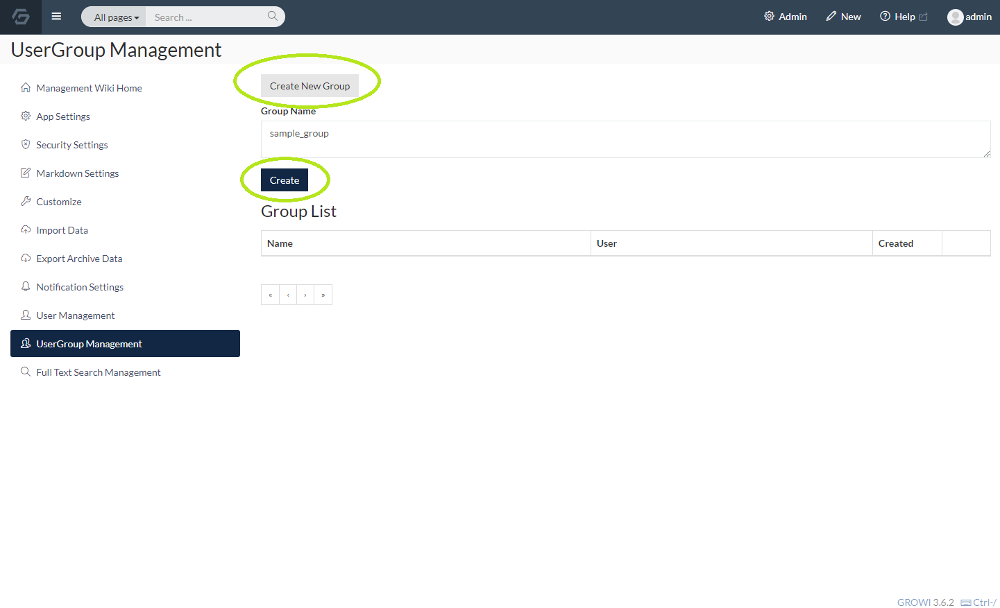
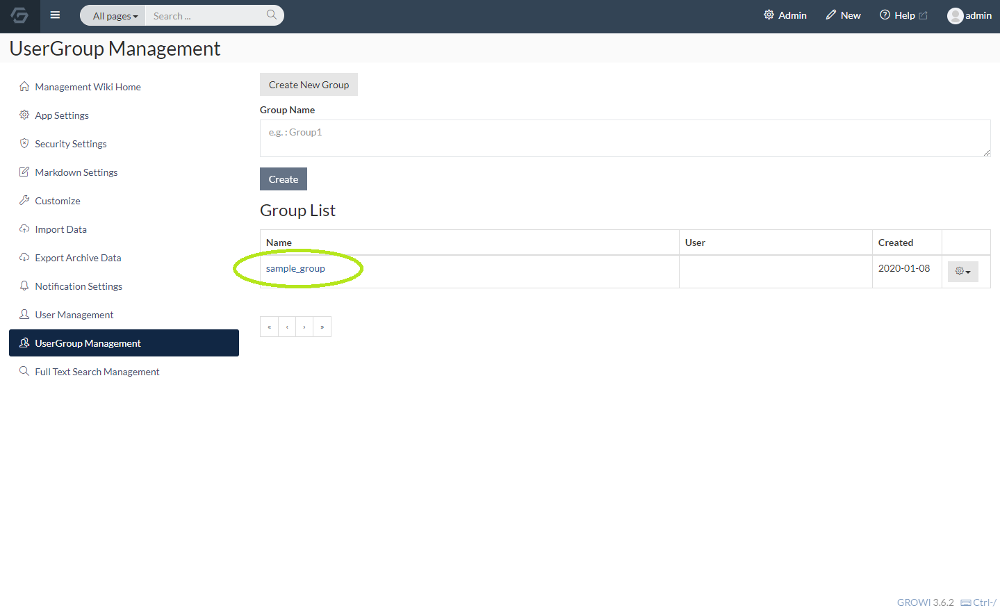
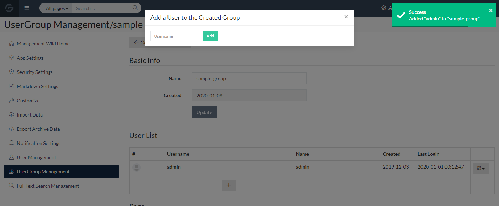
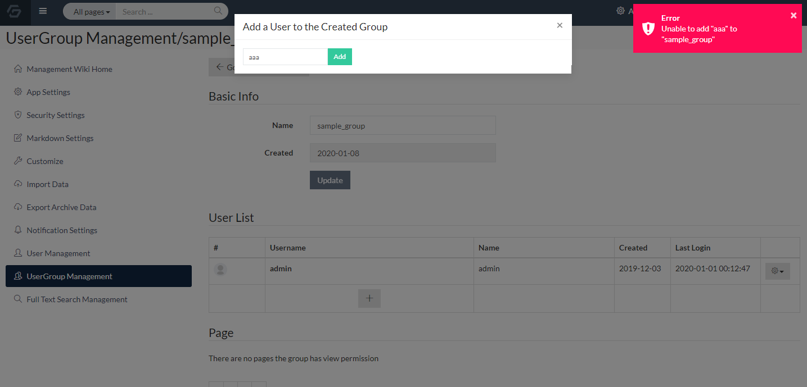
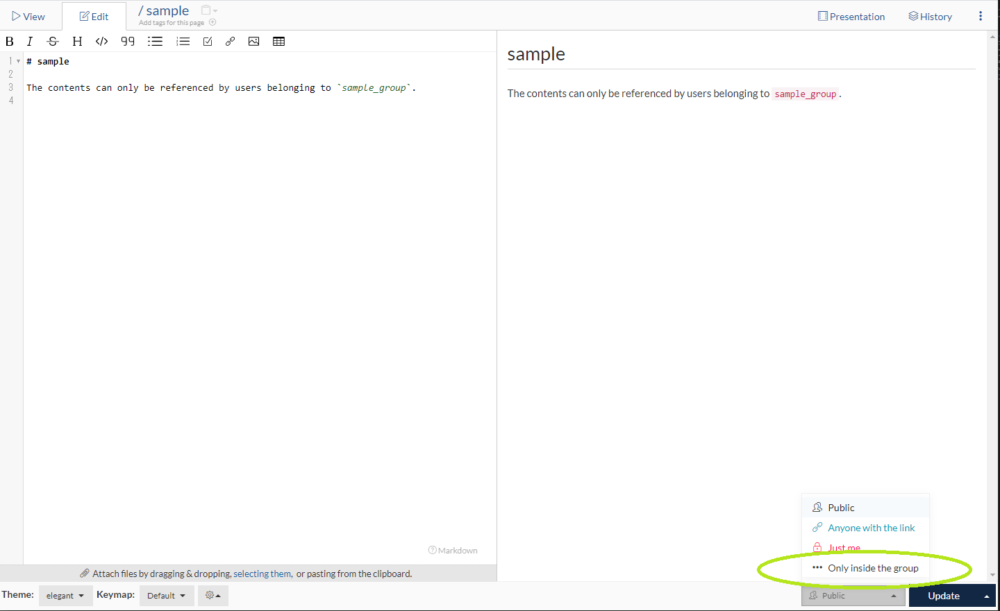
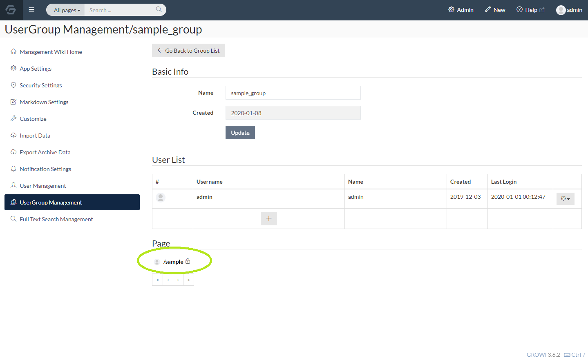

# UserGroup Management

By using the UserGroup Management function,
you can set the authority
on a page basis that only specific users can view and edit the contents.

Only authorized users can set groups from the administration menu.

## Create group

Go to "UserGroup Management" in the administration menu.

Click the "Create New Group" button first,
then enter a group name and click the "Create" button.

Success is displayed and the group is added to the Group List.

## Adding users to groups

Select a group in the Group List.

How to add a user to the group you selected is as follows.
Click the "+" button as shown in the image below.

An input box for adding a user to the group is displayed.

Enter the username registered as a user with your GROWI.

if the username has not been registered yet, an error will occur
and the user cannot be added to the group.

## Set browsing permissions for pages

After the group is created, set the view / edit authority to the page.

In the page edit mode, set "Only inside the group" as shown in the image below.

Then, the list of the groups you belong is displayed.

Select the group and click the Create / Update button.

If you see the notation that "Browsing of this page is restricted",
the authority setting is completed.

If you browse the page with an account that does not belong to the group,
you will not be able to view or edit the contents of the page.

## Refer to the list of authorization pages on the group management page

If you set view / edit authority to a page,
you can see a list of autholized pages on the UserGroup Management screen.

