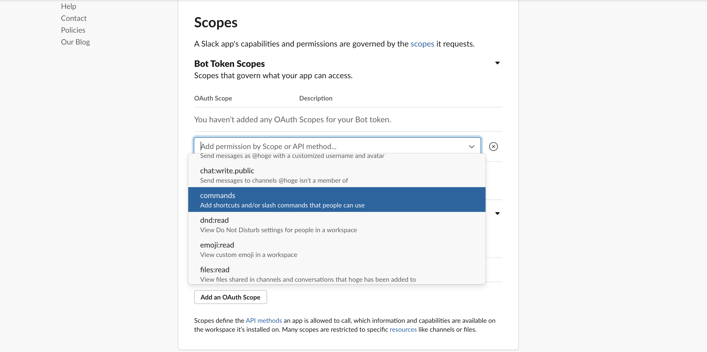
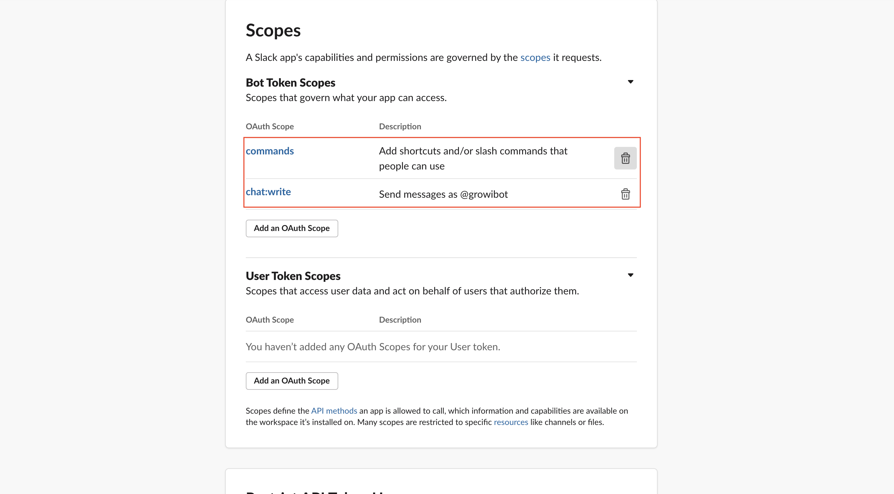
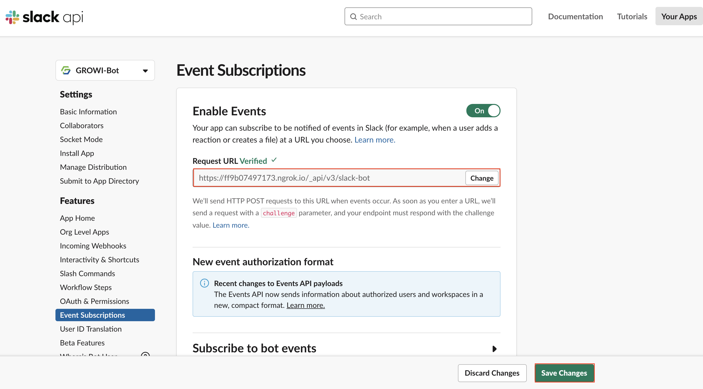
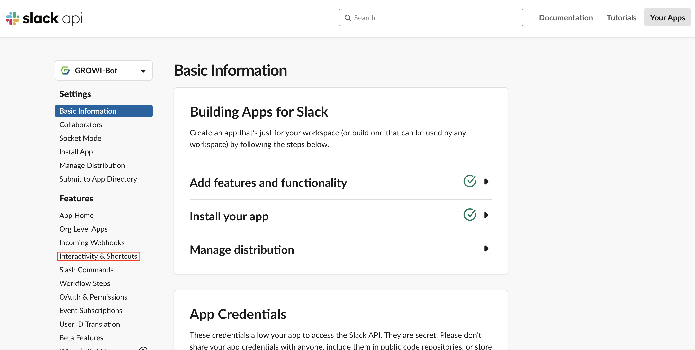
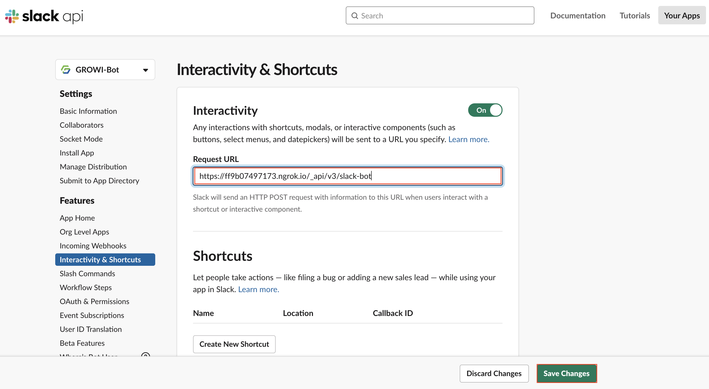
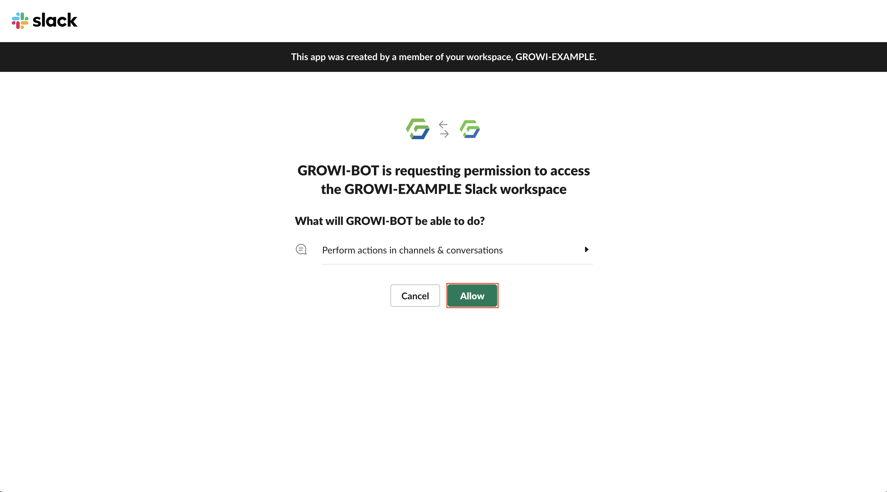

# Slack Integration

## Overview

GROWI provides two methods of Slack integration: 1. GROWI bot and 2. Incoming Webhook.

### 1. GROWI bot

The GROWI bot is a Slack App developed by the GROWI development team. By installing it in any Slack workspace, you can not only receive notifications from GROWI, but also execute full-text searches from chats, summarize conversations, and use various other functions.

#### Official bot (Recommended)

::: danger
This contents are not yet implemented.
:::

The Official GROWI bot is a free GROWI bot provided and operated by the GROWI development team.It is available at [slack app directory](https://wsgrowi.slack.com/apps) and anyone can use this service.

<!--以下の図は暫定的なものです。https://youtrack.weseek.co.jp/issue/GW-5421 で差し替えます。-->

#### Custom bot(non-proxy)

Custom bot(non-proxy) allows you to create a Slack bot and link it to your GROWI so that you can use some of the GROWI features from Slack.

<!--以下の図は暫定的なものです。https://youtrack.weseek.co.jp/issue/GW-5421 で差し替えます。-->

#### Custom bot(with-proxy)

::: danger
This contents are not yet implemented.
:::

Custom bot(with-proxy) allows you to create a Slack bot, set up and configure a proxy server, and use some of the features of GROWI in the same way as the Official bot.

### 2. Incoming Webhook

<!-- リンク未実装: external-notification がまだ en では書かれていないため。 -->

Incoming Webhook is another way to do Slack integration, but unlike GROWI bot, it is focused on notifications to Slack. It does not have many of the features of GROWI bot, such as full-text search from chat, but it is easier to set up.For more information, please click here.

<!-- [通知の種類/設定方法](/ja/admin-guide/management-cookbook/external-notification.html#通知の種類-設定方法). -->

### Custom bot (non-proxy) Setting

To deploy a custom bot (non-proxy) in your Slack workspace, you need to create and edit a Slack app. The steps are as follows.

#### Create Slack app

1. Go to the [App Page](https://api.slack.com/apps) of the Slack API and click [Create New App].

   

2. In the [Create a Slack App] section, ① input the name of your app in the [App Name] field and ② select the workspace where you want to add the GROWI bot in the [Development Slack Workspace].

3. Click the [Create App].

   

#### Set the scope

1. In the Slack App you created, go to **Features** and click **OAuth & Permissions**.
   
1. Click the **Add an OAuth Scope**
   
1. Select **commands** and **chat: write**
   
   

1. When the following OAuth Scope is displayed, the scope setting is complete.
   

#### Set each Request URL.

- Set Request URL of **Event Subscriptions**

  1. In the Slack App you created, go to **Features** and click **Event Subscriptions**.
     

  1. Turn on the button to the right side of **Enable Events**.
     

  1. Enter the Request URL as follows.

     - https:// your GROWI domain /\_api/v3/slack-bot
       - 例 https://example.com/_api/v3/slack-bot

     

  1. When you are done, click **Save Changes**.

- Set Request URL of **Interactivity & Shortcuts**

  1. In the Slack App you created, go to **Features** and click **Interactivity Shortcuts**.
     

  1. Turn on the button on the right side of **Interactivity**.
     

  1. For the Request URL, enter the same one you entered earlier.
     

  1. When you are done, click **Save Changes**.

#### Create Slash Commands

1. In the Slack App you created, go to **Features** and click **Slash Commands**.

<!--  -->

2. Click the **Create New Command**.

- Input /growi for Command.
- For RequestURL, enter the same Request URL you set above.
- Short Description is also required, so please enter an appropriate description.
- The Usage Hint is optional, so please enter it accordingly.
- The Escape channels, users, and links sent to your app is optional, so enter it accordingly.
- When you are done, click **Save**.

#### Install the Bot in your Slack workspace

1. In the Slack App you created, go to **Settings** and click **Basic Information**.
1. Click the **Install your app**.
   
1. Click the **Install to Workspace**.
   
1. On the destination screen, Click the**Allow**.
   
1. If you see a green check mark to the right of Install your app, the installation is complete in your workspace.
   
1. Invite the channel you want to use the GROWI bot on using @example.
   <!-- 差し替え -->
   
   

### Set the Official bot

### Set the Custom bot (with-proxy)

<!-- TODO: GW-5372 「Slack/Mattermost への通知」の内容を適切なタイトルの下に移動させる -->

### Set the Incoming webhook

<!-- TODO: GW-5372 「Slack/Mattermost への通知」の内容を適切なタイトルの下に移動させる -->

Set up a Slack workspace for notifications.

1. Access the security settings page (/admin/notification) in the administration panel.
1. Enter the required information for the Slack Incoming Webhooks setting, and click the Update button.

- **Webhook URL**  
  You can get it at [Incoming Webhooks](https://slack.com/services/new/incoming-webhook).

### Check if the settings are reflected.

After the above settings, a Slack notification form will be added to the edit mode screen of the page.

<!-- 差し替え -->

When a page is saved or updated, a Slack notification is sent to the channel you entered.  
This method of notification is referred to as **User Trigger Notification** in GROWI.

<!-- リンク未実装: external-notification がまだ en では書かれていないため。 -->

For details on how to configure User Trigger Notification, please refer to here

## What you can do with a Slack bot ?

### Full-text search in the workspace

1. If you enter /growi search [keyword(s)], the search results will be displayed.
   - e.g. /growi search example
     <!-- 差し替え全部 -->
     
   - Search results
     
   - Click the **Next** button to display the next search result.
     <!-- TODO post pictures after https://youtrack.weseek.co.jp/issue/GW-5283 -->
   - Click the **Share** button to share it within the channel.
     

<!-- ### 複数ワークスペースの横断検索 (TBD) -->

<!-- ### Slack ログの記録 (TBD) -->
