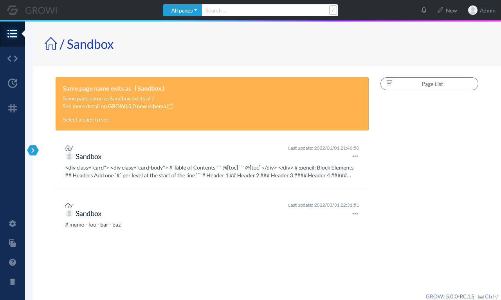
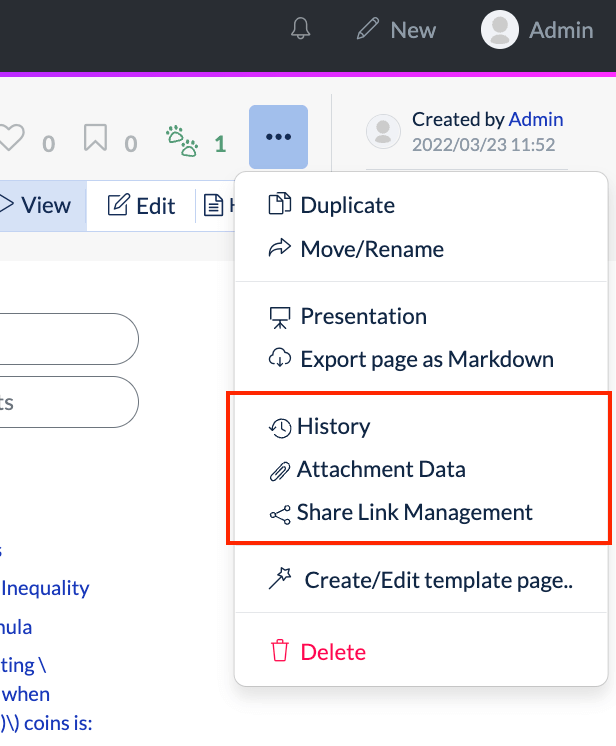
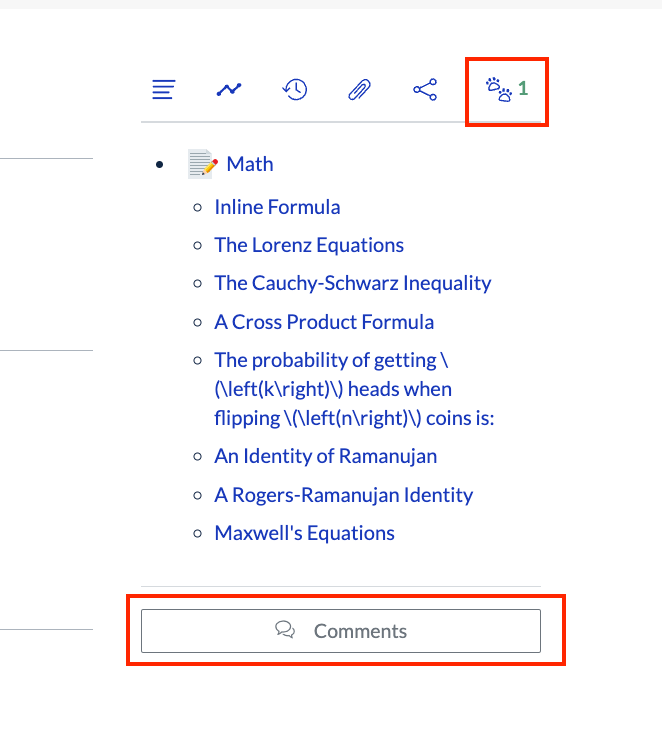
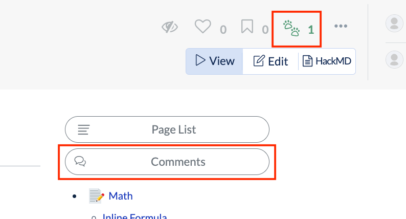

# Upgrading GROWI to v5.0.x

In v5.0, a page tree view has been added to the sidebar.
It will allow you to view the hierarchical structure of all pages.
Along with that, downgrading to the previous version is not supported because there is a big change in the specifications of handling descendant pages when moving, renaming, and deleting pages.

::: danger
To avoid making unintended changes to the "Publish to me only" and "Publish only to groups" pages,
administrators should check this upgrade guide and alert users to any changes.
:::

We also recommend you to read [What to Check Before Upgrading](#things-to-check-before-upgrading).

## Table of Contents

[[toc]]


## About Downgrading to v4.5 or lower

If you want to downgrade from v5.0 to v4.5 or lower, you need to migrate down the MongoDB schema before switching to v4.5 and booting.

For more information, please see [Downgrading from v5.0 to v4.5 or lower](/en/admin-guide/downgrading/50x-to-45x.html).

::: tip
Downgrading is available for systems running on-premise or running with [weseek/growi-docker-compose](https://github.com/weseek/growi-docker-compose).
Please note that downgrading is not supported for other forms of system operations.
:::

::: warning
Downgrading does not have the potential for data corruption, but there is a risk of data inconsistencies in the page's path.
Please undertake it at your own risk as an administrator.
:::


## Elasticsearch 7.x Support

v5.0 supports Elasticsearch version 7. And version 7 clients have become the default setting.

### About Using Elasticsearch 6.x

Elasticsearch does not maintain full downgrade compatibility between different major versions. Therefore, it will be necessary to change the client library used by GROWI, depending on if they are using Elasticsearch 6.x or earlier.

The default launch setting for GROWI v5.0 uses Elasticsearch 7-based clients to connect. To connect to Elasticsearch version 6, set the environment variable `ELASTICSEARCH_VERSION = 6` and start.

For more information about Administrator's Guide, please see [Environment Variables](/en/admin-guide/admin-cookbook/env-vars.html).

::: warning

- Elasticsearch version 6 will continue to be available, but is not recommended for use, as support for version 6 ended on February 10, 2022.
- In the near future GROWI will end support for Elasticsearch version 6 and will remove the code. We therefore recommend to upgrade to the latest version 7.x.

:::

### Replace from Elasticsearch 6.x to 7.x

Elastic version 6 and version 7 are officially said to be index compatible, but in order to avoid trouble when using it with GROWI, it is recommended to erase all existing index data and regenerate the index. Please refer to the procedure below.

#### On-premises

1. Uninstall Elasticsearch 6.
2. Install and launch Elasticsearch 7.
   - Confirm that the index data for GROWI does not exist (if it does exist, then ensure it does not inherit the data of Elasticsearch version 6).
3. Start GROWI v5.0.x.

### If Using Docker

1. Delete active Elasticsearch 6 container.
2. Delete docker volume from the Elasticsearch container.
3. Launch Elasticsearch 7 container.
   - Confirm that the index data for GROWI does not exist (if it does exist, then ensure it does not inherit the data of Elasticsearch version 6).
4. Start GROWI v5.0.x.

### If Using [weseek/growi-docker-compose](https://github.com/weseek/growi-docker-compose)

In addition to referring to [If Using Docker](#if-using-docker), please refer to this guide on github, [Wiki: Upgrade Elasticsearch from 6.x to 7.x](https://github.com/weseek/growi-docker-compose/wiki/Upgrade-Elasticsearch-from-6.x-to-7.x).

## About The New v5 Compatible Format

In v5.0, the internal data format of pages have changed significantly.

- All new pages created after the v5.0 upgrade will be created in the "New v5 Compatible Format"
- Pages created up to v4.5 **will not be automatically converted** to the New v5 Compatible Format
  - It can be converted to the new v5 compatible format with an external conversion operation by administrators or general users.

::: tip
You can still view, edit, and manage pages that have not been converted to v5 Compatible Formats, but you will not be able to use the new features implemented in v5.0.
:::

### Upgrade Operation to The New v5 Compatible Format

Administrators can perform the conversion process from the admin page to the v5 Compatible Format for all public pages.
This operation will bring the converted public page to the page tree.


For private pages, you can convert to the new v5 Compatible Format by clicking the "Old Format Private Pages" link at the bottom of the page tree,
or by accessing `/_private-legacy-pages` directly.
A list of pages that can be viewed by the logged-in user will be displayed.
Select the page you want to convert from the list and use the "Bulk Conversion" dropdown to convert it.


### Differences in Behavior Before and After Conversion

|                                                        |      Data created before v4.5       |                         New v5 Compatible Format Data                          |
| :----------------------------------------------------- | :---------------------------------: | :----------------------------------------------------------------------------: |
| **Display in Page Tree**                               |            Not Displayed            |                                   Displayed                                    |
| **Move / Delete Descendant Pages**                     |     Process only viewable pages     | Process all pages under it <br> (but, only for New v5 Compatible Format pages) |
| **View Permission Configuration for Descendant Pages** | All types of permissions can be set |     Only permissions with a narrower range than the parent page can be set     |

## [New Function] Maintenance Mode

It is now possible to switch the system to maintenance mode from the management page.

In maintenance mode, the page is not accessible to general users, as well as administrator users, who can only access the administration page and some API endpoints. With this function, you can prevent all data changes caused by creating, editing, and deleting page data and user data.

Please use this function when upgrading to the New v5 Compatible Format from the import / export function or the management page.

Maintenance mode can be enabled in the app settings on the management screen.


[Display when maintenance mode is enabled]


## [New Function] Page Tree

In v5.0, a page tree has been added to the sidebar that allows you to view the hierarchical structure of all pages.
Using the tree-like UI, it's possible to open and close descendant pages to display them, and move pages around by dragging and dropping.

::: warning
Only new v5 Compatible Format pages will be displayed in the page tree.
:::

## [Specification Change] Change of Specifications for Moving / Renaming / Deleting Pages

The new v5 Compatible Page behaves differently when moving / renaming / deleting than it did before on v4.5.

Until v4.5, when you selected "Process with descendant pages", any decendant pages that were unable to be viewed by the operating user would remain unprocessed.

<div style="font-weight:bold;color:#900">
    In v5.0,  if you do not have permission to view descendant pages, they will be moved / renamed / deleted together.
</div>
※ However, pages set to "Only Those Who Know The Link" are not included in the target of moving / renaming / deleting.

For more details, please see [Setting Page Viewing / Editing Permissions](/en/guide/features/authority.html).

Also, up to v4.5 it was possible to select "Whether to Process with Descendant Pages" when moving / renaming.
In v5.0, move / rename is now an operation that also involves descendant pages (not selectable). Regarding the deletion process, you can still select "Whether to Process with Descendant Pages".

## [New Function] Added Options for Page Deletion Process

In v5.0, in order to prevent the situation where the user accidentally deletes a large number of pages, the operation of "Whether to Process with Descendant Pages" or "Whether to Delete Completely" is permitted or disallowed from the management page. It is now possible to make more detailed selections.

For more information about Administrator's Guide, please see [Security Settings](/en/admin-guide/management-cookbook/security.html).

## [Specification Change] Page Path and Permalink

Until v4.5, page paths were unique in the system and pages with the same page path could not be created.

With the implementation of the page tree in v5.0, page navigation and renaming had to be processed faster than before.
As a trade-off, the previously unique page path has been changed to allow duplication. The effects are listed below.

### The URL Displayed in The Address Bar of The Browser Becomes a Permalink

Until v4.5, the URL for page browsing / transition was based on the page path `/Page1/Page1-1/...`. Access via permalinks represented by the page ID was also redirected to the page path.

In v5.0, it is the complete opposite, and the URL at the time of page browsing / transition is a permalink expressed by the page ID. On the other hand, access by page path is redirected to the permalink represented by the page ID.

You do not need to be aware of this specification change when using it. When sharing URLs, you can share both page path-based URLs and permalinks without any problems.

### Duplicate Detection

In v5.0, there can be multiple pages with the same page path.
For example when accessing with a page path-based URL such as `/Page1/Page1-1/...`, if there are multiple pages associated with the path,
the following page will be displayed indicating that there is a duplicate. The user can move to that page by selecting one from the list.

| Duplicate Page List |
|:--:|
||


::: tip

- Duplicate page paths are a "Side Effect"
- We do not expect users to intentionally create pages with duplicate page paths, and we do not provide a function to perform such operations.
  :::

## [Specification Change] Page Delete Permission

Starting with v5, you can specify the page delete permission in more detail.

For more information about the Administrator's Guide, please see [Security Settings](/en/admin-guide/management-cookbook/security.html).

## [New Function / Specification Change] User Group Parent-Child Settings

In v5.0, it is possible to set a parent-child relationship between user groups.

For example, you can create a "Design Team" as a child group of the "Technical Department" group and register some members in the technical department group.

For more information about the Administrator's Guide, please see [Group Management](/en/admin-guide/management-cookbook/group.html).

## [Specification Change] Specification Change of Viewing Authority Setting for Page

Until v4.5, you could freely set the viewing authority for any page.

In v5.0, pages under a page `/Page1` can only have the same or more restrictive view permissions.

For more information about the User's Guide, please see [View / Edit Permission Page Setting](/en/guide/features/authority.html).

### Specification Change of "Specific Group Only" Setting for The Page

Even with the "Specific Group Only" setting, the child pages can only have the same view permissions as the parent page, or only apply view permissions that have more restrictions (groups with a narrower range of members).

For more information about the User's Guide, please see [View / Edit Permission Page Setting](/en/guide/features/authority.html).

### Precautions When Converting to New v5 Compatible Format Data

Due to the new specification change in v5.0, it may not be possible to convert pages with viewing authorities up to v4.5. For example, `/Page1` is set to "Specific Group Only" and its child page`/Page1/Page1-1` is set to "Public". In such case, you need to follow the steps below.

1. Move either `/Page1` or`/Page1/Page1-1` to a path without a parent-child relationship before conversion
2. Convert `/Page1` and`/Page1/Page1-1` individually to the new v5 Compatible Format
3. If necessary, reset (move) the parent-child relationship after resetting the viewing authority according to the specifications of v5.0.

## [UI Changes] Changes to icon placement on the page, leading users to more content

In v5.0, the UI that leads users to content has changed.

### History, Attached Data, Shared Link Management

The following icons which were first placed at the top of the table of contents, have moved into the three-point reader dropdown.

| Before | | After |
|:--:|:--:|:--:|
|| ⇒ ||

### Timeline

The timeline (listing the contents of descendant pages) can be viewed by clicking the page list button at the top of the table of contents.

| Before | | After |
|:--:|:--:|:--:|
|| ⇒ ||

### Others

The position of the following link buttons has changed.

- Footprint icon for displaying the page browsing user list
- Link button to scroll to the comment list

| Before | | After |
|:--:|:--:|:--:|
|| ⇒ ||

Users who are comfortable with previous versions of the UI may be confused by these changes.
**We recommend that you share these changes before and after the upgrade, to avoid users being confused.**。

## Things to Check Before Upgrading

- [x] **At least 1 system administrator has read the entire upgrade guide and understands the implementations**
- [x] Upgrade Elasticsearch to version 7, or set the environment variable `ELASTICSEARCH_VERSION = 6` to continue using Elasticsearch version 6
- [x] Inform GROWI users about the change of access URI
- [x] Inform GROWI users about changes in move / rename / delete behavior
- [x] Inform GROWI users about "Old Version Private Pages"
- [x] Inform GROWI users about the UI changes involving icon placement on the page, leading users to more content.

### Example of Well-known Content to Users

You can copy the following text and use it publicly.

```
GROWI has been upgraded to v5.0.0. There are some changes for users, so please check the details below.

Official Upgrade Guide
https://docs.growi.org/en/admin-guide/upgrading/50x.html


Access URI has been changed
---------------------------

- In the new version, the URL displayed in the browser's address bar will be a permalink instead of the page path URL.
    - Before: http://example.com/Page1/Page1-1
    - After: http://example.com/61d04d3aecc2ec9f6cce3d3e


The behavior of move / rename / delete has been changed
----------------------------------------

- In the new version, if you move / rename / delete the parent page, all the pages under it will also be affected.
    - However, private pages that are set to "Only Me" or "Only Specific Group" remain in the old format, so they are not affected now.
    - Please convert your manageable private pages from http://example.com/_private-legacy-pages to the new format.
    - Please note that after converting these private pages, **move / rename / delete functions on the parent page will now effect the private page**.


Page Tree Added
----------------------------

- Available from the sidebar.


UI has been changed
----------------

- The following icons located at the top of the table of contents have been moved into the three-point reader dropdown.
    - Page List (Displaying the Page list of Descendants)
    - Timeline (Listing the Contents of Descendant Pages)
    - Change Log
    - Attached Data
    - Shared Link Management
- Also, the position of the following link buttons has changed.
    - Footprint icon for displaying the page browsing user list
    - Link button to scroll to the comment list
```
