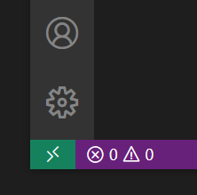
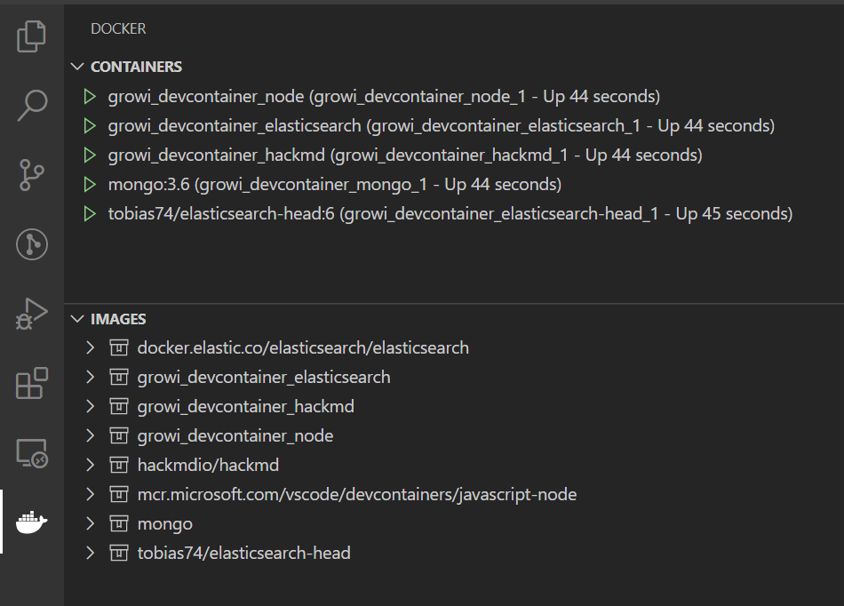

# Creating a Development Enviroment

::: tip Note
The below documentation details our development environment at WESEEK Inc.  It may include some tools
that are not necessary for your use case.
:::


## Tools to Prepare

### 3-Way Merge Tool

1. Install P4Merge (Helix Visual Client (P4V))
    * Download and install P4V here: [https://www.perforce.com/downloads/helix-visual-client-p4v](https://www.perforce.com/downloads/helix-visual-client-p4v)
    * Complete user registration
2. Set up P4Merge
    * Choose any 2 files on the Diff tab
    * Edit -&gt; Preferences...
        * For Character encoding, select `Unicode (UTF-8, no BOM)` or `Unicode(UTF-8)` (with no BOM setting)
        * For Line ending type, select UNIX (LF)

### GUI Client for Git

::: tip WESEEK Rule
Developers who are not used to Git functionality (branches, reset, rebase) should use a GUI client.
GUI clients make it easy to develop while keeping in mind the tree structure of the Git repository and
related considerations
:::

1. Install SourceTree
    * Download and install SourceTree here: [https://ja.atlassian.com/software/sourcetree](https://ja.atlassian.com/software/sourcetree)
    * If you recive a dialog saying "Unable to find Git", select "Download Git for use with SourceTree only"
2. Set up SourceTree
    1. Open a terminal using SourceTree
    2. Disable autoCRLF
        * Copy-paste this command into the terminal: `git config --global core.autoCRLF false`
    3. Set up your personal Git account
        * Tools &gt; Options &gt; General
        * Set up Default User Information as appropriate
    4. Set up P4Merge
        * Tools &gt; Options &gt; Diff
        * External Diff Tool &gt; Merge Tool &gt; select P4Merge
    5. Default character encoding
        * Tools &gt; Options &gt; General
        * Default character encoding &gt; select utf-8

### GUI Client for MongoDB

1. Install [Robo 3T](https://robomongo.org/download)


## Git Setup

Devcontainer will automatically inherit settings from Docker.  
These settings must be set up on the host side.

:::: tabs

::: tab "Windows" id="tab-git-configuration-win"

1. In a WSL2 terminal on the docker host machine, execute the following commands

    ```bash
    # name, email settings
    git config --global user.name "Your Name"
    git config --global user.email "yourname@example.com"
    # If you are using Windows, you will also need to set up a credential helper for WSL to reference the local machines settings
    git config --global credential.helper "/mnt/c/Program\ Files/Git/mingw64/libexec/git-core/git-credential-manager.exe"
    ```

1. In order to use the credential helper, you will need the following settings:
    <https://help.github.com/en/github/using-git/caching-your-github-password-in-git>

:::

::: tab "Mac" id="tab-git-configuration-mac"

1. Open a terminal and execute the following commands

    ```bash
    # name, email settings
    git config --global user.name "Your Name"
    git config --global user.email "yourname@example.com"
    ```

1. In order to use the credential helper, you will need the following settings:
    <https://help.github.com/en/github/using-git/caching-your-github-password-in-git>

:::

::::


## Install an execution environment for docker and docker-compose

:::: tabs

::: tab "Windows" id="tab-docker-win"

※These settings are not compatible with Virtualbox

1. Set up the environment for use with WSL2
    1. Install the [WSL2 Linux Kernel Package](https://docs.microsoft.com/ja-jp/windows/wsl/wsl2-kernel)
    1. Open PowerShell with administrator privileges and execute the following:

        ```bash
        # Disable Hyper-V
        Disable-WindowsOptionalFeature -Online -FeatureName $("Microsoft-Hyper-V")
        # Enable WSL
        Enable-WindowsOptionalFeature -Online -FeatureName $("VirtualMachinePlatform", "Microsoft-Windows-Subsystem-Linux")
        ```

    1. Install Ubuntu from the Microsoft Store
        * Install the "Ubuntu" package (with no version number in the title)
            * The latest version (20.04 as of this writing) will automatically be installed
        * Set up your user account and log in
        * Confirmation

            ```bash
            > wsl -l -v
            NAME      STATE           VERSION
            * Ubuntu    Stopped         2
            ```

        * If the VERSION says 1, execute `wsl --set-version Ubuntu 2` to change the distribution.
    1. Limit memory size due to the issue that WSL 2 consumes massive amounts of RAM ([microsoft/WSL#4166](https://github.com/microsoft/WSL/issues/4166))
        * Edit or create `C:\Users\YourAccout\.wslconfig`

        ```
        [wsl2]
        memory=6GB
        swap=0
        ```

1. Install [Docker Desktop](https://www.docker.com/products/docker-desktop)

:::

::: tab "Mac" id="tab-docker-mac"

1. Install [Docker Desktop](https://www.docker.com/products/docker-desktop)
    1. Increase the RAM because of 2 GB runtime memory is set by default.
        * Reference: [Get started with Docker Desktop for Mac | Resources](https://docs.docker.com/docker-for-mac/#resources)

:::

::::


## Set up Visual Studio Code

1. Install [Visual Studio Code](https://code.visualstudio.com/download)
2. Install extensions
    * Remote - Development
    * Docker


## Preparing a Workspace

In order to develop using devcontainer, you need to set up a directory tree as follows:

```
- GROWI
    - growi                   <-- weseek/growi repository
    - growi-docker-compose    <-- weseek/growi-docker-compose repository
    - node_modules            <-- an empty directory for developing plugin
```

### Procedures

* If you are using Windows, use WSL to execute the following commands; on Mac use the included terminal

::: warning
**Check before starting**
`git config -l --global` should show autoCRLF set to false
:::

```bash
mkdir -p ~/Projects/GROWI
cd ~/Projects/GROWI
git clone https://github.com/weseek/growi.git
git clone https://github.com/weseek/growi-docker-compose.git
# Create an empty directory for plugin development
mkdir node_modules
```

### Register in the SourceTree repository list

* Register the repository cloned above
  * Path for WSL (Windows users): `\\wsl$\Ubuntu\home\{your account}\Projects\GROWI\growi`


## Activating the GROWI-Dev devcontainer

1. Open Visual Studio Code
1. From the Remote Connection indicator, open the devcontainer repository
    * 
    * Remote-Containers: Open folder in Container...
    * Select the weseek/growi repository
        * WSL path for Windows: `\\wsl$\Ubuntu\home\{your account}\Projects\GROWI\growi`
1. For first time users wait 5-10 minutes for the download and building of various docker container images.
1. If there was no error, you should see 5 docker container images in the sidebar
    * 


### Confirmation

To ensure there were no errors in setup, confirm the following information
in the GROWI-Dev devcontainer window.


#### Git Settings

* In terminal, display your Git settings.  They should look similar to the following.
  * In Windows, check the WSL global settings
  * In Mac, check the local PC global settings

    ```bash
    $ git config -l --show-origin
    file:/home/node/.gitconfig      user.name=Your Name
    file:/home/node/.gitconfig      user.email=yourname@example.com
    file:/home/node/.gitconfig      credential.helper=!f() { /home/node/.vscode-server/bin/a5d1cc28bb5da32ec67e86cc50f84c67cc690321/node /tmp/vscode-remote-containers-c717012556037588bd78c4b869724bf548d49841.js $*; }; f
    file:.git/config        core.repositoryformatversion=0
    file:.git/config        core.filemode=true
    file:.git/config        core.bare=false
    file:.git/config        core.logallrefupdates=true
    file:.git/config        remote.origin.url=https://github.com/weseek/growi.git
    file:.git/config        remote.origin.fetch=+refs/heads/*:refs/remotes/origin/*
    file:.git/config        branch.master.remote=origin
    file:.git/config        branch.master.merge=refs/heads/master
    ```

  * It is normal for the `credential.helper` setting to look like a script as shown above
  


## Troubleshooting

### Remote WSL connestion failure

#### Symptom of the problem

```
sh: 1: /scripts/wslServer.sh: not found
```

#### Resolution

1. Uninstall VSCode
1. Delete `C:\Users\${YourAccount}\.vscode`
1. Reinstall VSCode
