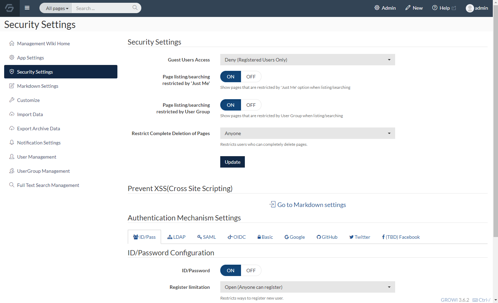

# Set page view / edit authority

GROWI users can be set so that only authorized users can view and edit the page.

This section describes the authority that can be set for pages.

## How to set view / edit authority for pages

In the edit mode of the page,
click the "▲" enclosed in red line of the below image first,
then the options are displayed as shown in the image below.

After selecting this option,
click the "Create / Update" button view / edit authority for the page apply.

## Types that can be set as view / edit authority

You can select any of the following for the contents
that can be set as page view / edit restrictions.

### Public

  There is no viewing or editing restriction for pages with this setting.
  Anyone can view and edit. This is the default.

  If the entire GROWI is `settings that cannot be viewed without logging in`,

  Even if the page is public,
  you will not be able to view or edit it unless you log in,
  and if you access the page, you will be redirected to the login page.

  Anyone who is logged in can view and edit.

### Anyone with the link

  Pages with this setting will not be output to the page list or page search results.

  Only users who know the URL of the page will be able to view and edit it.

  If you do not know where to place the page,
  follow the page from "Recently Created" on the home page.

  If it is a page you created, it will be output to this page list.

### Just me

  Pages with this setting cannot be viewed or edited by anyone other than yourself.

  Whether it is displayed in page list and page search results of other users
  can be set by ON / OFF of the management page.

  By default, it appears in the page list and page search results.

### Only inside the group

  Pages with this setting can only be viewed and edited by users
  belonging to the set group.

  Whether it is displayed in page list and page search results of a user not in group
  can be set by ON / OFF of the management page.

  By default, it appears in the page list and page search results.

## About group management feature

Click [here](/en/admin-guide/management-cookbook/group.md) for details

## Control showing list and search result for privilege pages

If you don't want to show a page to someone who doesn't have vieing and editing privileges when viewing GROWI's search results or page list, switching on / off function of the corresponding setting in `Security setting` of management menu.

### Show page list and restricted pages as 'Only me'

- Case of switching "ON"

  It will show restricted pages that applied
  as search result or page list for the users except you.

- Case of switching "off"

  It will not show restricted pages that applied
  as search result or page list for the users except you.
  

### Show page list and restricted pages for specific groups

- Case of switching "ON"

  It will show restricted pages that applied
  as search result or page list for the users who do not belong to any groups.

- Case of switching "off"

  It will not show restricted pages that applied
  as search result or page list for the users who do not belong to any groups.

## Set viewing and editing privileges to be under the page at once

There are the case that you want to manage all privileges at once, cause page is hierarchical structure.

In this case, please click "▲" of "Create / Update" button which appears in the lower right corner of the screen when in create/edit.

then, click "Update and Overwrite scopes of all descendants".

By this operation, be able to apply same privilege settings to all pages under the corresponding page.

## Example of setting privileges

Basically, you can be easy to manage if you organize pages together which needs viewing and editing privileges and then update at once under the corresponding pages.

Move the pages that need privileges like as shown example below, if Updating the studctures of the page has no problem.

- Create a group name page

- Move the page that you want to set viewing or editing privileges for only applicable group, to the under the page.

  Click [here](/en/guide/features/page_operation.md) for how to move pages

- Set privilege for group name pages at once
