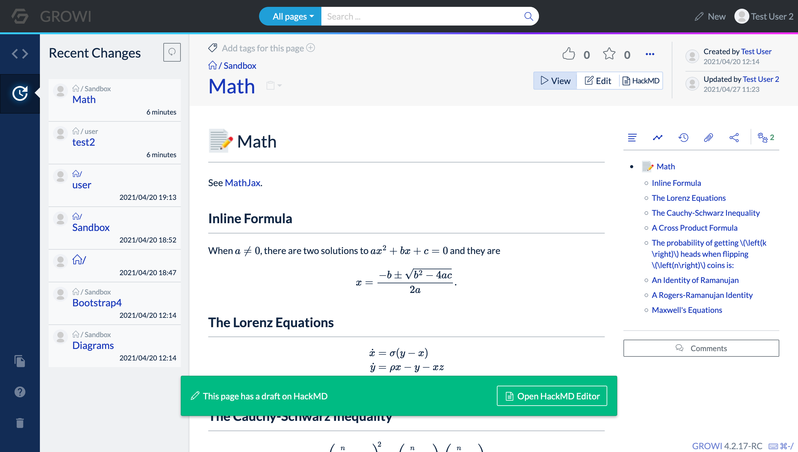
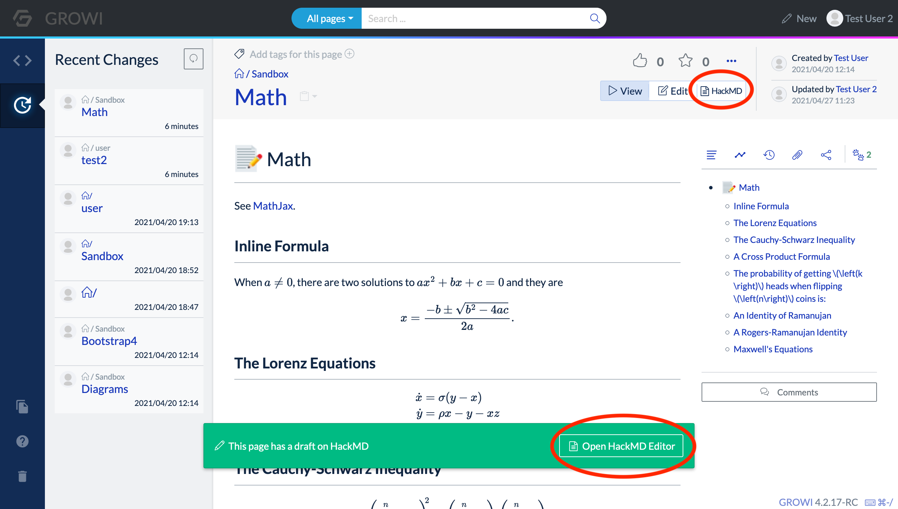
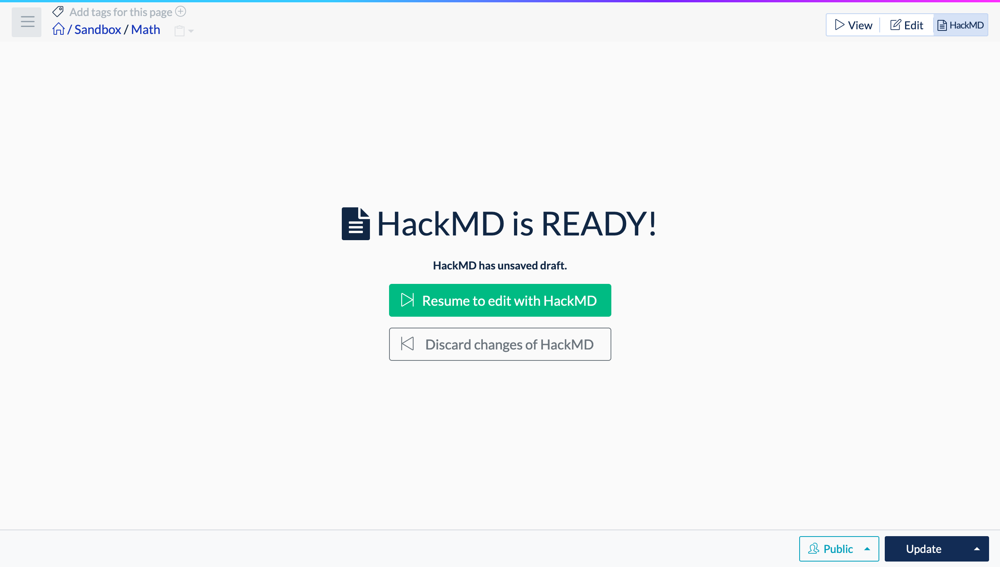
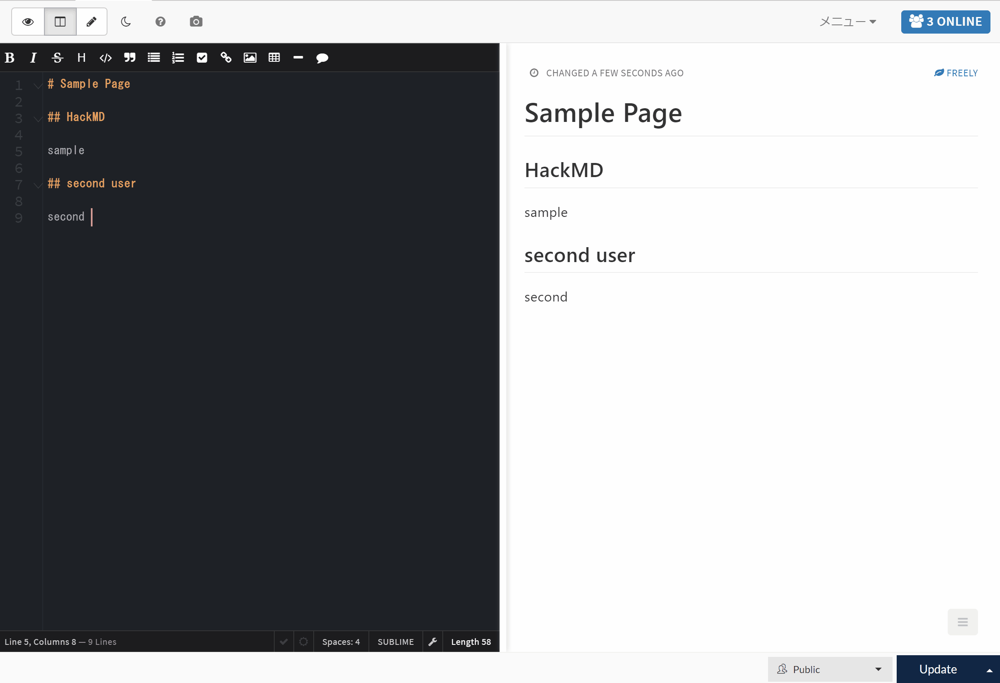
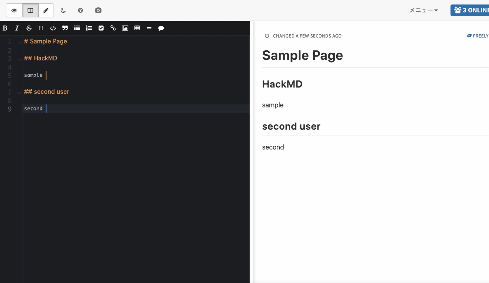

# Simultaneous group editing with HackMD

GROWI can be used with HackMD to allow multiple people to edit a page at the same time.

This section will explain how to use it.

## What is HackMD?

HackMD is an open source tool that allows multiple people to edit a document written in Markdown and preview it in real time.

By linking with HackMD, GROWI allows multiple people to edit a document within GROWI at the same time.

## Setting up HackMD

In order to use HackMD, GROWI and HackMD must be linked and configured in advance.

Refer to the separate [Administrator Guide page](/admin-guide/admin-cookbook/integrate-with-hackmd.html) for this configuration.

The following explanation assumes that the GROWI environment has been configured to use HackMD.

## Editing a page in HackMD mode

By selecting the HackMD tab under the reference/editing menu tab (encircled in red in the image below), the page will be opened in HackMD mode.

HackMD can be used by one person, but the following section explains how to use HackMD with two user accounts to edit a page.

### Start editing in HackMD mode
User A and User B will edit the same page at the same time.

1. User A clicks on the tab `HackMD` in the Edit Page section.

   When clicked, the message `HackMD is READY!` and the button `Start to edit with HackMD` will be displayed.

   

2. Click on the `Start to edit with HackMD` button

   Click on it to start editing in HackMD mode, as shown in the image below.

   

This is all it takes to edit the page in HackMD mode.

User B will then join this page as a second editor.

### Second and subsequent participants

When user B opens the page, the following message appears at the bottom of the screen  
`This page has a draft on HackMD >> Open HackMD Editor`.

At this point, select the HackMD part in the view/edit/HackMD tab, or click the `Open HackMD Editor` link at the bottom of the screen.  

The same `Start to edit with HackMD` button as for user A will then appear, or a screen with a `Resume to edit with HackMD` button and a `Discard changes of HackMD` button will appear.

### `Start to edit with HackMD` button appears

If the HackMD button is clicked when no one is editing the page, or when the edits are saved, `Start to edit with HackMD` button will be displayed.

### The `Resume to edit with HackMD` button and the `Discard changes of HackMD` button are displayed

If another user is already editing a page with HackMD, and the HackMD button is clicked by the second user when the page is not yet saved in HackMD mode, the `Resume to edit with HackMD` and `Discard changes of HackMD` buttons will be displayed.  

### `Resume to edit with HackMD` button

Open a page in HackMD mode by taking over the edits of another user who is editing the page in HackMD mode.

### `Discard changes of HackMD` button

Discard the unsaved edits of another user who is currently editing the page and open the page in HackMD mode

After pressing the Discard button, a new `Start to edit with HackMD` button will appear.

Pressing the `Start to edit with HackMD` after the Discard button will discard unsaved edits by other users, and the editing screen of all users in HackMD mode will be reverted to the state where the page was last saved.

:::warning
Pressing the `Start to edit with HackMD` button after pressing the `Discard` button will discard all unsaved edits made in HackMD mode, even for other users.  
:::

## Simultaneous editing of articles

More than one user can edit an article at the same time.

When two users operate at the same time, it will look like the following.

### User A's editing screen

### User B's editing screen

Multiple cursors will appear and the document could be edited at the same time.

## Save edits

When a user presses the "Refresh" button, the edits of all users will be saved to the page.

The user who presses the Refresh button will switch from HackMD mode to Browse mode, while the other users will continue to edit the page.

Pressing Ctrl+S on Windows or Command+S on Mac while in HackMD mode will save the page while in HackMD mode.

## Precautions when using HackMD mode

::: warning
If a user is editing a page in HackMD mode and another user saves the page in the built-in editor (which is not HackMD), the page edits will conflict and the update button will not work on the HackMD side.

In this situation, you will not be able to start editing in HackMD mode even after updating the page, and you will get a `DRAFT MAY BE OUTDATED` alert.

If this message appears,
  click the `Discard it` link or the `Discard changes of HackMD` button
and start editing from the latest version of the page.
because the update (saving) in normal editing mode takes precedence over editing in HackMD mode.  

**This will discard any edits made on HackMD.**
:::
