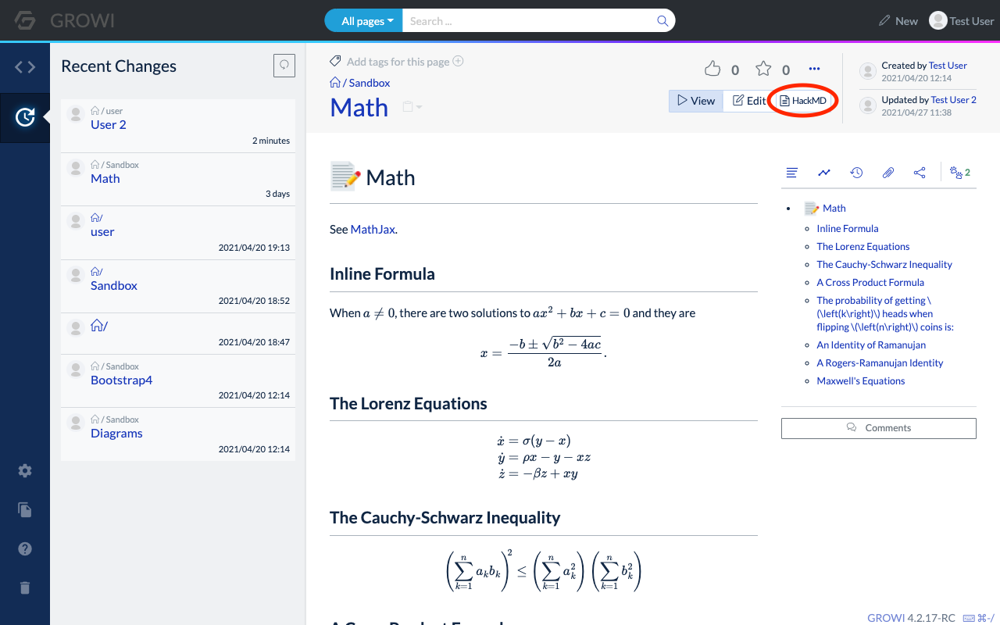
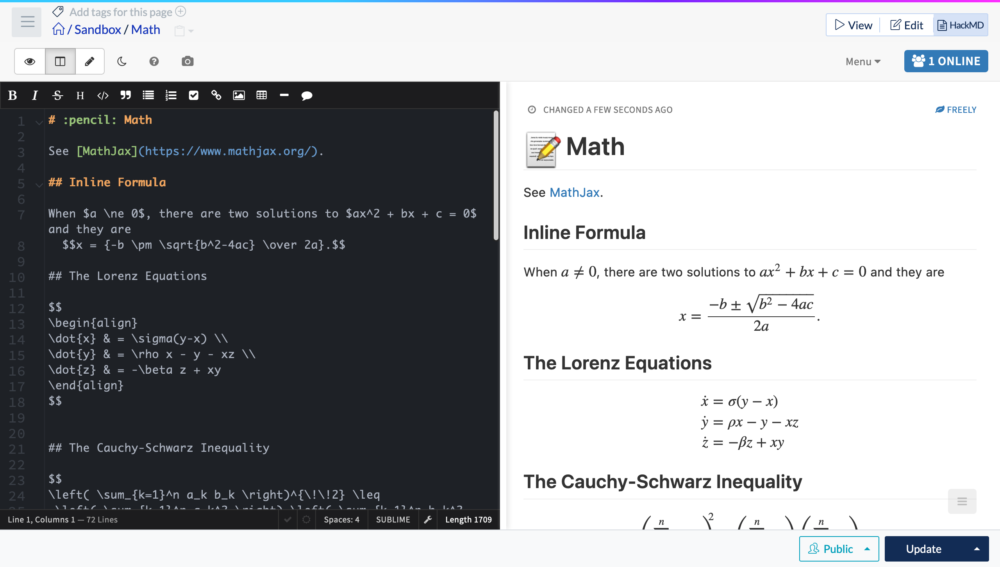

# Using simultaneous group editing with HackMD

GROWI can be used with HackMD to allow multiple people to edit a page at the same time.

This section will explain how to use it.

## What is HackMD?
HackMD is an open source tool that allows multiple people to edit a document written in Markdown and preview it in real time.

By linking with HackMD, GROWI allows multiple people to edit a document under GROWI control at the same time.

## Settings for using HackMD
In order to use HackMD, GROWI and HackMD must be linked and configured in advance.

Refer to the separate [Administrator Guide page](/admin-guide/admin-cookbook/integrate-with-hackmd.html) for this configuration.

The following explanation assumes that the GROWI environment has been configured to use HackMD.

## Editing a page in HackMD mode
By selecting the HackMD tab (encircled in red in the image below) in the tab for switching the page's reference editing mode, the page will be edited in HackMD mode.

HackMD can be used by one person, but here is how to use HackMD with two user accounts to edit a page.

### Start editing in HackMD mode
User A and User B will be editing the same page at the same time. 1.

User A clicks on the tab `HackMD` in the Edit Page section.

   When clicked, the message `HackMD is READY!` and the button `Start to edit with HackMD` will be displayed.

   

1. click on the `Start to edit with HackMD` button

   Click on it to start editing in HackMD mode, as shown in the image below.

   

This is all it takes to edit the page in HackMD mode.

User B then joins this page as a concurrent editor.

### Second and subsequent participants
When user B refers to the previous page, the following message appears at the bottom of the screen  
This page has a draft on HackMD >> Open HackMD Editor`.

At this point, select the HackMD part in the view / edit / HackMD tab, or click the `Open HackMD Editor` link at the bottom of the screen.  

The same `Start to edit with HackMD` button as for user A will then appear, or  
A screen with a `Resume to edit with HackMD` button and a `Discard changes of HackMD` button will appear.

### `Start to edit with HackMD` button appears
If the HackMD button is clicked when no one is editing the page, or when the edits are saved, the
The `Start to edit with HackMD` button will be displayed.

### The `Resume to edit with HackMD` button and the `Discard changes of HackMD` button are displayed
If another user is already editing the page with HackMD and you want to  
If another user is already editing a page with HackMD and clicks on the HackMD button when the page is `not yet saved in HackMD mode`, the `Resume to edit with HackMD` and `Discard changes of HackMD` buttons will be displayed.  
The `Resume to edit with HackMD` button will be displayed.

### `Resume to edit with HackMD` button
Open a page in HackMD mode by taking over the edits of another user who is editing the page in HackMD mode.

### `Discard changes of HackMD` button
Discard the previous edits of another user who is editing the page and open the page in HackMD mode.

After pressing the Discard button, a new `Start to edit with HackMD` button will appear.

Pressing the `Start to edit with HackMD` button that appears after the Discard button is pressed will open the HackMD mode screen for another user.  
If you click the `Start to edit with HackMD` button displayed after pressing the `Discard` button, the content that another user was editing in HackMD mode will be discarded, and all users in HackMD mode will be able to start editing.
The editing screen of all users in HackMD mode will be set to the state where the page is saved at the end.

:::warning
Pressing the `Start to edit with HackMD` button after pressing the `Discard` button will discard all edits made in HackMD mode.  
:::

## Simultaneous editing of articles

More than one user can edit an article at the same time.

When two users operate at the same time, it will look like the following.

### User A's operation screen

### User B's operation screen

The following example shows how to use the "Edit" function in the "Edit" screen.

## Save edits

When a user presses the "Refresh" button, the edits of all users will be saved to the page.

The user who presses the Refresh button will switch from HackMD mode to Browse mode, while the other users will continue to edit the page.

All other users can continue to edit in HackMD mode.

Pressing Ctrl+S on Windows or Command+S on Mac while in HackMD mode will save the page while in HackMD mode.

## Notes on using HackMD mode

::: warning
If a user is editing a page in HackMD mode and another user saves the page in the built-in editor (which is not HackMD), the page editing information will conflict and the page will not be saved in HackMD mode.
The page edit information will conflict and the update button will not work on the HackMD side.

In this state, editing cannot be started in HackMD mode even after updating the page, and  
In this situation, you will not be able to start editing in HackMD mode even after updating the page, and you will get a `DRAFT MEY BE OUTDATED` alert.

If this message appears, please click the `Discard it` link or the `Discard changes of HackMD` button, because the update (save) in normal editing mode takes precedence over editing in HackMD mode.  
 If you get this message, click the `Discard it` link or the `Discard changes of HackMD` button, and then
When you see this message, click the `Discard it` link or the `Discard changes of HackMD` button and start editing from the latest version of the page.

When you do this, any edits you have made on HackMD will be discarded.
:::
