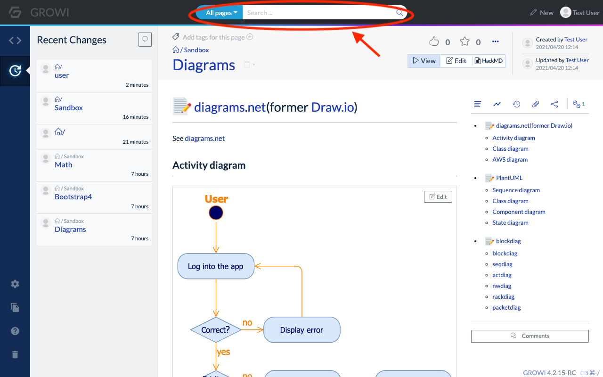

# Search pages

:::warning
To use this function, it is required to set up Elastic search as a search DB. Check [this](../admin-guide/admin-cookbook/setting-elasticsearch.md) page to find out how.
:::

From the search bar on the top bar of the page, enter a page path, text body, or tags to search for pages. (It will not be displayed if the setup is incomplete.)

When a keyword is entered in the search bar, page paths that partially match the keyword are displayed as shown below. Those pages can be accessed from the results.

By pressing the magnifying glass icon on the search bar or pressing the Enter (Return) key, pages containing the keywords in the page path or body will be displayed in a list. Change the scope of the search by selecting "All pages" or "Only children of this tree" from the dropdown on the left side of the search bar.

## Search result page
Enter a keyword in the search bar and press the Enter (return) key to move to the search result page as shown below

- List of page names
  - A list of page names that match the search is displayed on the left side of the screen.
  - The profile image of the last person who updated the page is displayed on the left side of the page name.
  - Click the page name to see a preview of that page on the right side of the screen.
  - On the right side of the page name, meta information such as the number of likes, comments, and whether or not the page is open is displayed as an icon.
  - You can set the display of pages with limited disclosure range from the security settings on the management screen.
  - You can move to that page from the icon on the right side of the list.
  - Press "Deletion Mode" at the top left of the list to enter page deletion mode, where you can delete the checked page.

  

- Page preview
  - A preview of the page path that hit the search is displayed on the right side of the screen.
  - You can move to that page by clicking the page name.
  - The tags that the page has are also displayed.
  - If you do not have permission to view the page, the preview will not be displayed.  - そのページへの閲覧権限がない場合はプレビューは表示されません。
<!-- 
### Search options
When searching, you can specify options with the following notation. Options can be used together.
| Options | Overview | 
| --- | --- | --- |
| Search by multiple keywords | If you specify multiple words with a space in between, the page name or body will search for pages that include all of them.   For example, `word1 word2` will search for pages that contain both` word1` and `word2` in the page name or body. |
| Search for pages that include the specified text in the text | If you insert a text between double quotes, the page that contains that text in the text will be searched.   For example, `" This is GROWI "` will search for pages that contain` "" This is GROWI "` in the body. |
| Exclusion by keyword | If you specify a keyword after the half-width hyphen `-`, the page that contains the keyword in the page name or body is excluded.   For example, `-keyword` excludes pages that contain` keyword` in the page name or body. |
| Search by first match of page name | If you specify a page name after `prefix:`, the page starting with that page name is searched.   For example, `prefix: / user /` finds pages whose page names start with `/ user /`. |
| Exclusion by first match of page name | Specifying a page name after `-prefix:` excludes pages starting with that page name.   For example, `-prefix: / user /` excludes pages whose page names start with `/ user /`. |
| Search by tag | If you specify a tag after `tag:`, the page containing that tag will be searched.   For example, `tag: wiki` will search for pages that contain the tag` wiki`. |
| Exclude by tag | Specifying a tag after `-tag:` excludes pages that contain that tag. For example, `-tag: wiki` excludes pages that contain the tag` wiki`. | -->