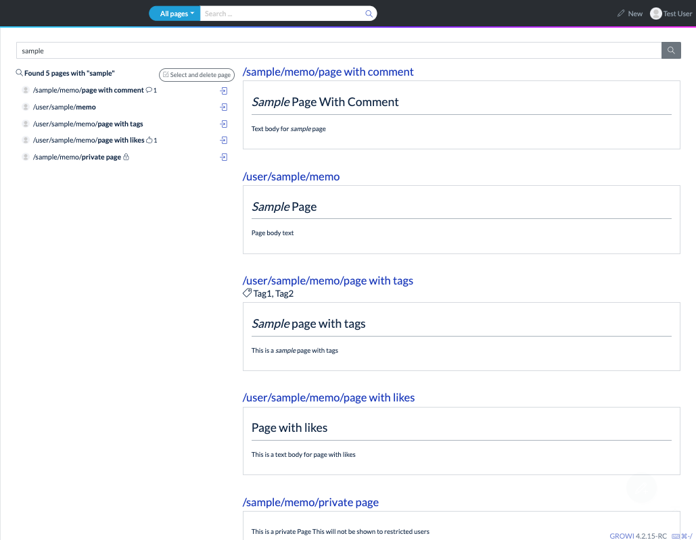

# Search pages
:::warning
To use this function, setting up Elasticsearch as a search-engine database is required. <!-- Todo: Insert link to elasticsearch settings: Check [this](../admin-guide/admin-cookbook/setting-elasticsearch.md) page to find out how. -->
:::

From the search bar on the Navbar, enter a page path, text body, or tags to search for pages. (It will not be displayed if the setup is incomplete.)

When a keyword is entered in the search bar, page paths that partially match the keyword are displayed as shown below. Those pages can be accessed from these results.

In addition, clicking the magnifying glass icon on the search bar or pressing the Enter (Return) key will display a list of pages that contain the keyword in the page path or text. At this time, you can change the search range by selecting "All pages" or "Only children of this tree" from the drop-down menu on the left side of the search bar.

## Search result page
Enter a keyword in the search bar and press the Enter (return) key to move to the search result page as shown below.

- List of page names
  - A list of page names that were found in the search is displayed on the left side of the screen.
  - The profile image of the last person who updated the page is displayed on the left side of the page name.
  - Click the page name to see a preview of that page on the right side of the screen.
  - On the right side of the page name, meta information such as the number of likes, comments, and privacy settings is displayed as an icon.
    - Visibility of the restricted pages can be configured from security settings in the admin page.
  - Click the icon on the right side of the list to go to the page.
  - Click "DeletionMode" in the upper left corner of the list to enter the page deletion mode and delete the checked pages.

  

- Page previews
  - The previews of the pages that were found in the search are displayed on the right side of the screen.
  - Click the page name to move to that page.
  - The tags that the page has will also be displayed.
  - If the user does not have permission to view the page, the preview will not be displayed.
  
### Search options
When searching, options can be specified with the following notation. Options can be used together.

| Options | Overview |
| --- | --- |
| Search by multiple keywords | If multiple words with space in between are entered, the page name or body will be searched for pages that include all of them.   For example, `word1 word2` will search for pages that contain both `word1` and `word2` in the page name or body. |
| Search for pages that include the specified text in the body | If text is entered with double quotes, the page that contains that text in the page body will be searched.   For example, `"This is GROWI"` will search for pages that contain `This is GROWI` in the body text. |
| Exclusion by keyword | If a keyword is specified after a half-width hyphen `-`, the page that contains the keyword in the page name or body is excluded.   For example, `-keyword` excludes pages that contain `keyword` in the page name or body. |
| Search by the first match of the page name | If a page name is specified after `prefix:`, pages starting with that page name is searched.   For example, `prefix:/user/` finds pages whose page names start with `/user/`. |
| Exclusion by the first match of the page name | Specifying a page name after `-prefix:` excludes pages starting with that page name.   For example, `-prefix:/user/` excludes pages whose page names start with `/user/`. |
| Search by tag | If a tag is specified after `tag:`, the page containing that tag will be searched.   For example, `tag:wiki` will search for pages that contain the tag `wiki`. |
| Exclusion by tag | Specifying a tag after `-tag:` excludes pages that contain that tag. For example, `-tag:wiki` excludes pages that contain the tag `wiki`. |