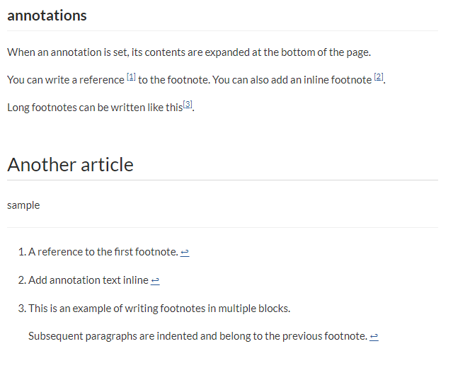

# Creating annotations and footnotes

You can add annotations and footnotes to your GROWI wiki.
When you add an annotation, a footnote appears at the bottom of the page.

## How to write annotations and footnotes

### Using references

You can add a footer reference to a footnote using the notation
`[^#]`, where `#` is the footnote number, e.g. `[^1]`, `[^2]`, etc. You can add a footnote reference anywhere in the document you want.  The corresponding footnote should be annotated using `[^#]:`, the same text but with a colon at the end.

You can write the annotation reference using plain English as well.
For example, you could use an annotation like `[^longnote]`; the footnote would be annotated `[^longnote]:` (with a colon).

Both the reference `[^1]` and the annotation `[^1]:` must exist.
If either one is not present, the other will not function as an annotation.

### Inline annotations

You can add annotations inline using the Markdown code `[^Add annotation text inline]`
(using your own annotation text).

When you use a text annotation, the footnote will automatically be assigned a numeric reference.

## Writing long footnotes with paragraphs

If you would like to add a line break into your footnote, you can continue your footnote after the line break by adding an indentation to the beginning of the following paragraph.

## Example

```markdown
## annotations
When an annotation is set, its contents are expanded at the bottom of the page.

You can write a reference [^1] to the footnote.
You can also add an inline footnote ^[Add annotation text inline].

Long footnotes can be written like this[^longnote].

[^1]: A reference to the first footnote.

[^longnote]: This is an example of writing footnotes in multiple blocks.

    Subsequent paragraphs are indented and belong to the previous footnote.


# Another article
sample
```

When you create a GROWI page with the above Markdown text, the page created will look like the image below.


