# Create page

## Set up GROWI

When you visit the GROWI URL for the first time, there will be a dialog to set the administrator ID.

After logging in to GROWI, the following screen will appear.

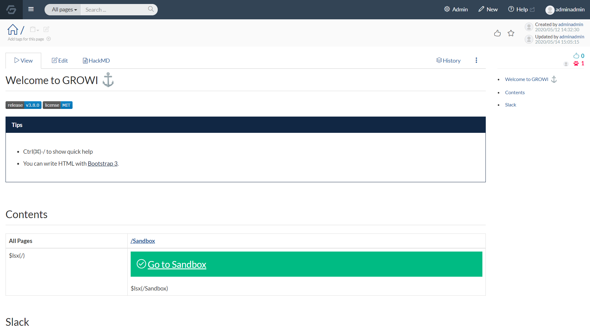

Start the tutorial here.

## Create new page

Click the “New” button at the top right of the screen to display the page creation dialog.

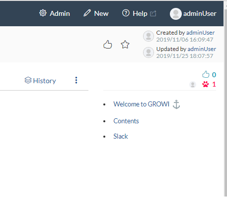

Enter "tutorial" in the middle box.

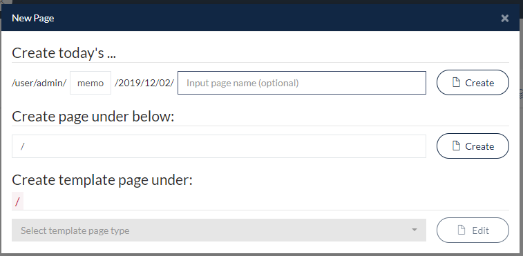

Click the Create button.

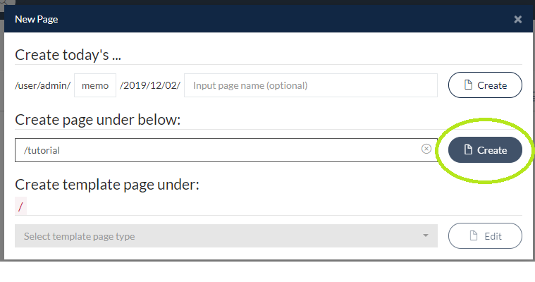

You will now be moved to the Edit Page screen.

Copy the following Markdown code and paste it into the editing box.

```
# First page
## Header1
* List1
* List2
## Header2
1. Number list
2. Number list
```

When pasting, a preview reflecting the contents in real time is displayed
on the right side of the screen, as shown below.


You can also try typing into the editing box and checking the preview on the right.

After editing, click the Create button and you will be taken to view your new page as shown below.


You can switch between the View and Edit tabs to view or edit your page.

## Headers

You can add a header or subheader to a page by prefixing your header text with a pound (or hash, or sharp) sign (#).
You can increase the subheader level by adding additional pounds.
A space is required immediately after the final pound.

When you create a header, the header is automatically added to the index on the right side of the page.


## Hierarchical information

Information in a document can be organized hierarchically using hyphens or asterisks.

Copy the following Markdown code into a new page.

```
# Learn how to use GROWI
On this page, you will learn how to use GROWI by following the GROWI Docs tutorial.

## Creating and editing pages
Create and edit pages.

## Using headers and text
Learn how to use headers and text.

### Header
When you create a header, an index is created on the right side of the page.

### Documents
Write text to create a document. Sentences can be organized into paragraphs.

You can create an unordered list of information using any of the following symbols and spaces.
- hyphen `-`
- asterisk `*`
    - Additional hierarchies
        - Even more additional hierarchies
    - Move up one level
```

To create a line break in a hierarchical structure,
put two spaces or a tab at the beginning of the new line.

You can confirm the hierarchy on the preview screen.

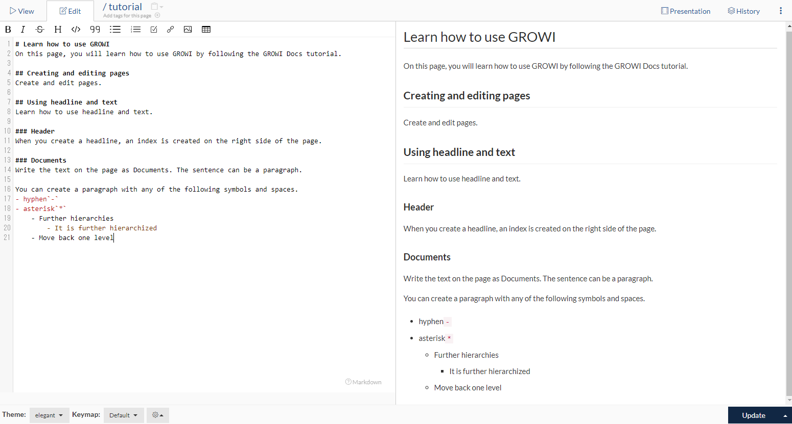

Organize the content of the document by adding and removing hierarchies.


Using hierarchies to organize information is a good practice for creating wikis
that are easy to read even with a lot of text.

## Link to an external web page

A link can be inserted using the link button in the edit toolbar.

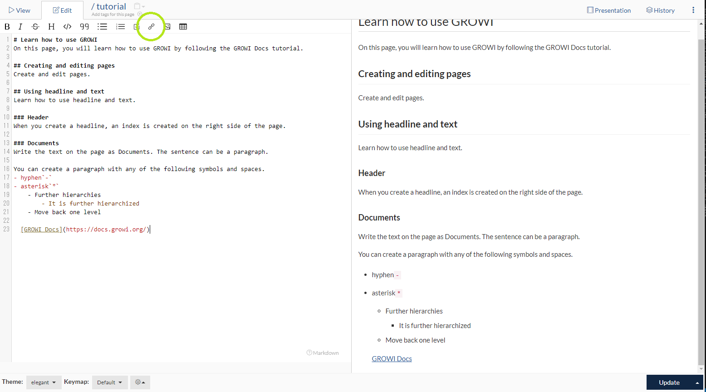

You can also create a link using square brackets (`[]`) and round brackets (`()`).
Put the link text in the square brackets the page URL in the round brackets.

  ```
  [GROWI Docs](https://docs.growi.org/)
  ```

## Insert an image

An image can be inserted using the insert image button in the edit toolbar.
You can also insert an image by prepending an exclamation mark (`!`) to the
link format (`[]()`) discussed above.

```
### Insert an image
  
```

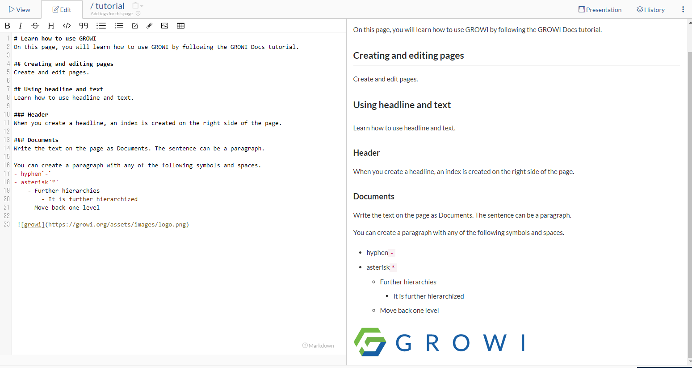

You can upload your own images using the Attach function at the bottom of the edit screen.


The Attach function allows you to upload files to AWS or GCS.

To attach files to your pages, you may need to configure settings on your wiki management page.
Click [here](/en/admin-guide/management-cookbook/attachment.html#mongodb-gridfs-%E3%81%B8%E3%81%AE%E3%82%A2%E3%83%83%E3%83%97%E3%83%AD%E3%83%BC%E3%83%89)
for instructions.

::: tip
When you upload an image on the new page,
The disclosure range is automatically changed to **Only for me**.
Click [here](/en/guide/features/authority.html#%E3%83%9A%E3%83%BC%E3%82%B8%E3%81%AB%E5%AF%BE%E3%81%99%E3%82%8B%E9%96%B2%E8%A6%A7%E3%83%BB%E7%B7%A8%E9%9B%86%E6%A8%A9%E9%99%90%E3%81%AE%E8%A8%AD%E5%AE%9A%E6%96%B9%E6%B3%95)
for instructions.
:::

## Use emoji

You can add emoji to your pages by enclosing emoji words in colons (`:`).

```
## use emoji　:beginner:
```


You can find a list of supported emoji words [here](/en/guide/features/emoji.html).

## Miscellaneous formatting

You can use various types of formatting to format your document:

- Bold
- Constant-width red text
- Horizontal Line
- Strikethrough
- Constant width text for paragraphs

Paste the following Markdown text into a new page and check the preview.

```
### Formatting
Here are some useful ways to format your sentences and paragraphs.
- Bold
  Surround the point you want to **emphasize** with two asterisks.
  
    ```
    **Emphasis**
    ```
  
  
- Constant-width red text
  Enclose the text you want to emphasize with `backticks`.
  
    ```
    `backticks`
    ```
  
- Horizontal line
  
  Write three hyphens to create a horizontal line.
  
  ---
  
- Strikethrough
  
  ~~ Strike out this text ~~ Enclose the text to strike out with two tildes.

  
- Constant-width text for paragraphs
  Surround the paragraph with three `backticks`.
```


## Create tables

Use two or more pipes (`|`) and press Enter to create a table.

You can also create a table by clicking the table button in the edit toolbar.

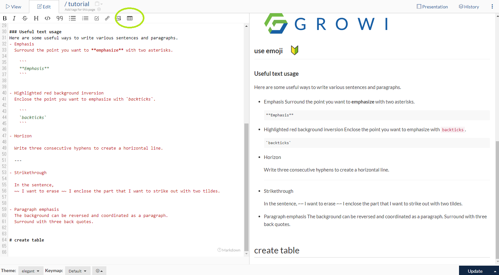

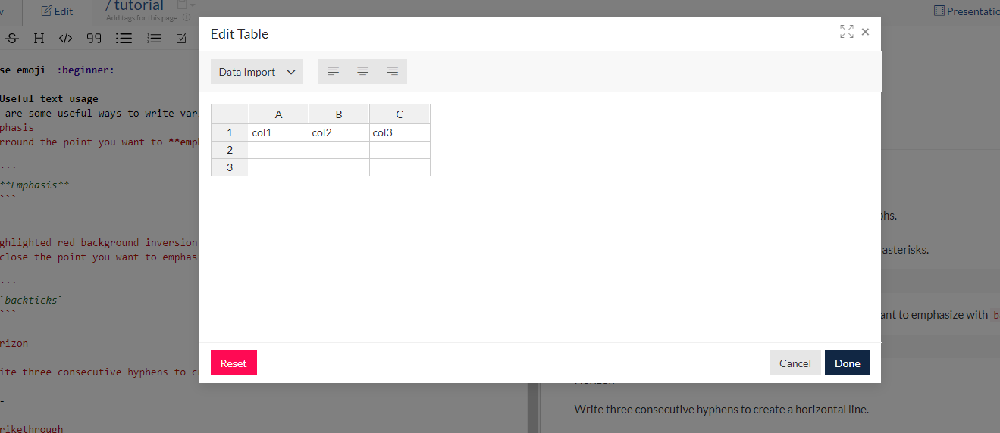

You even can edit the created table in View mode.
When you place the cursor on the table in View mode, the edit icon
is displayed.

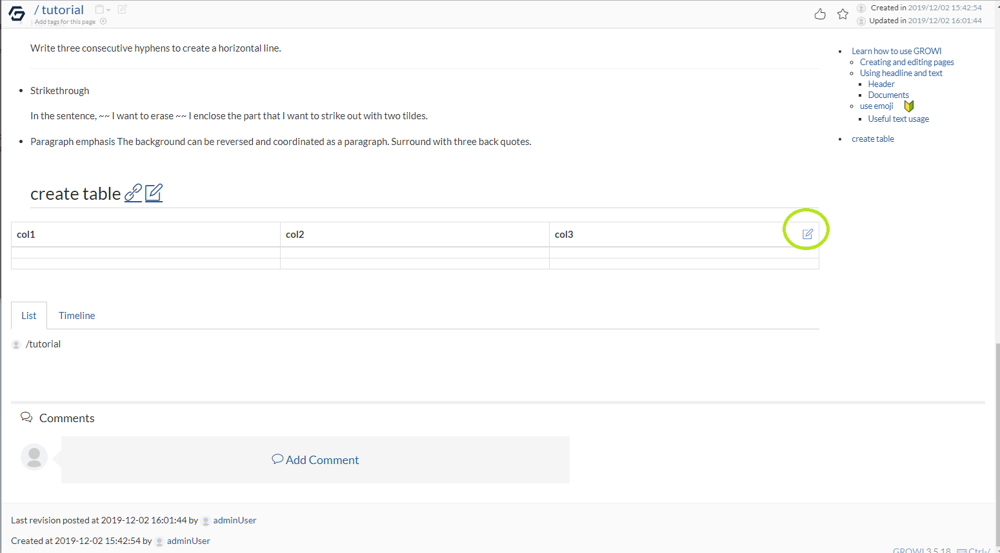

Click to edit the table.

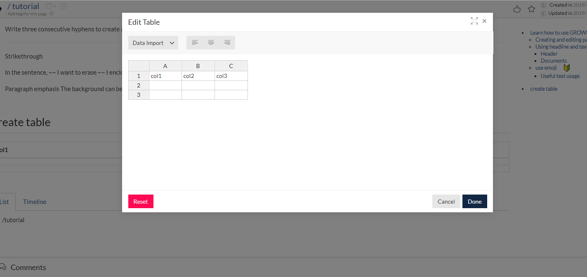

## Create a page list

GROWI has a convenient function to create lists of pages.

Navigate to any parent page (a page with child pages) and add `lsx` as shown below.

```
$lsx()
```

The child page list is generated automatically.


Additional details can be found [here](/en/guide/tips/hierarchical.html).

Now that you have completed this tutorial,
you can create pages and grow your wiki.
