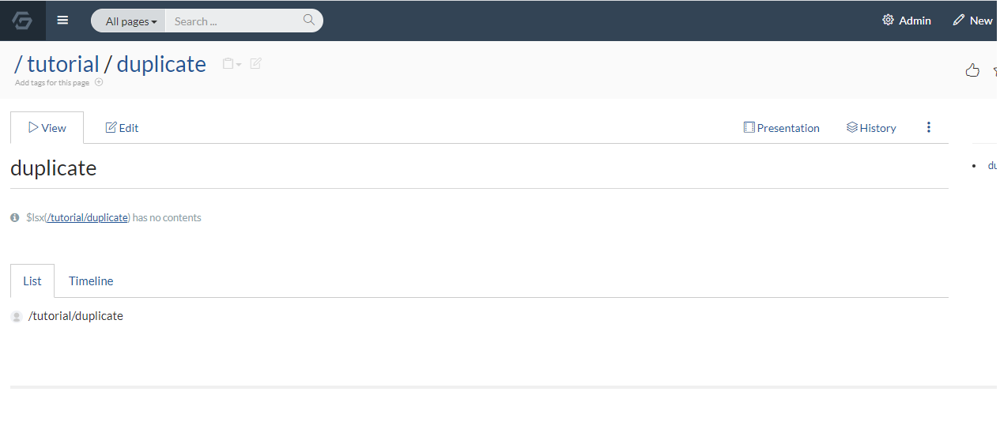
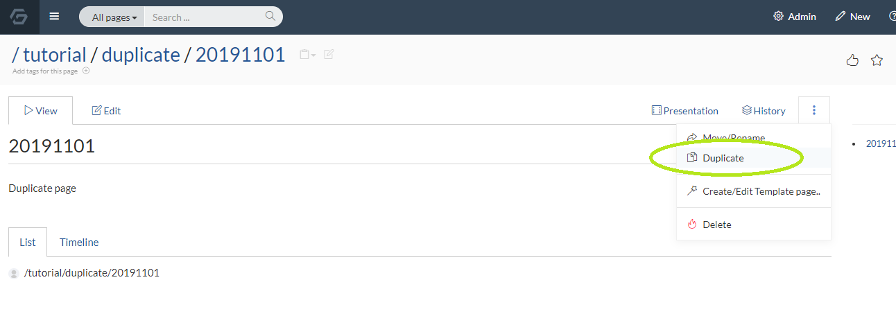
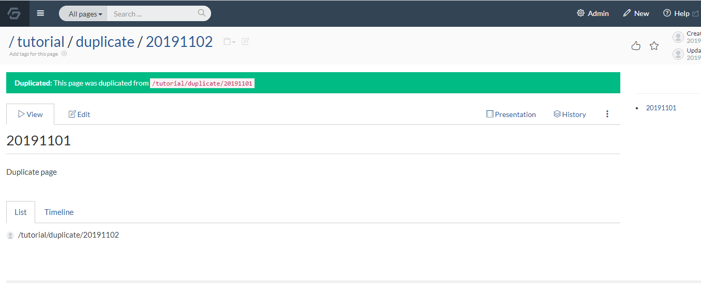
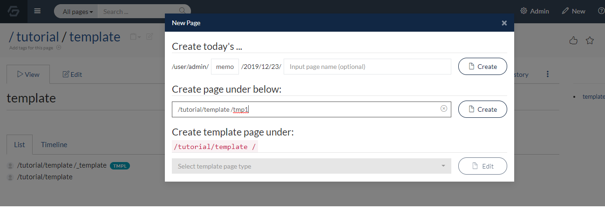
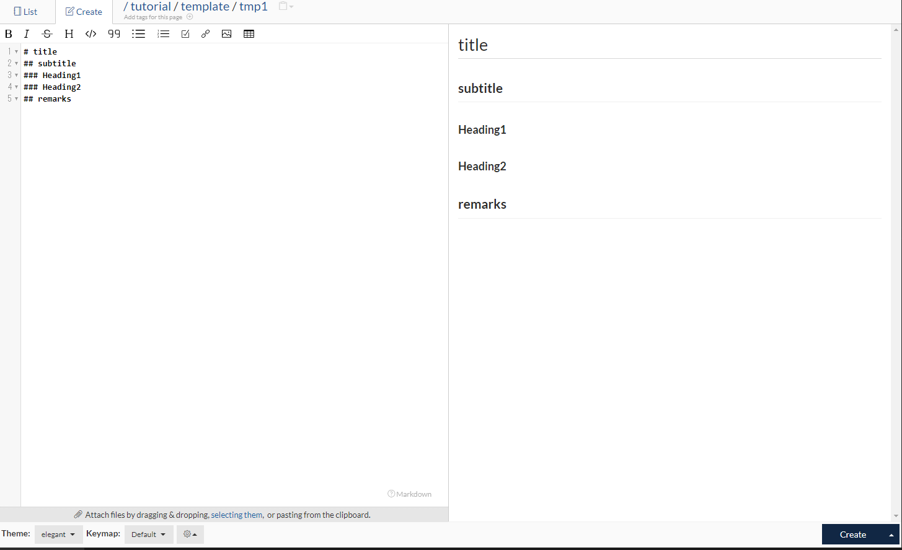
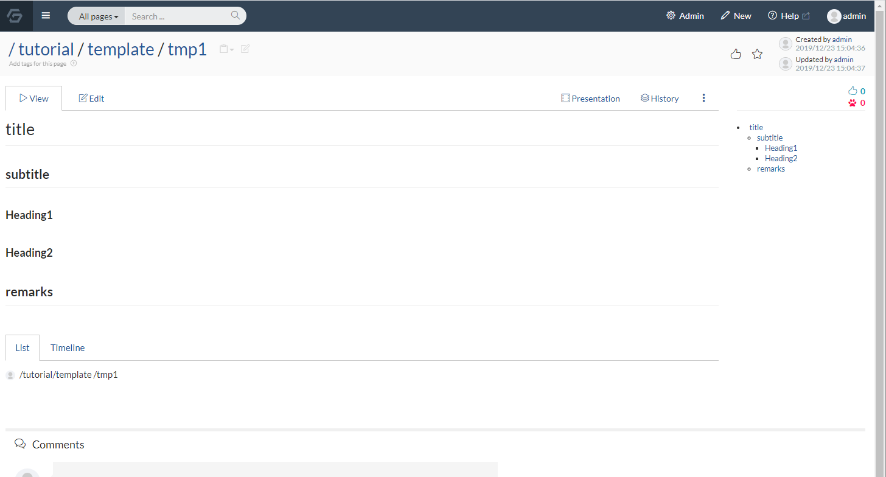

# Duplicate page

If you have a page style that you use often, duplicating pages or creating templates can be very useful.

## Setup - Create a page

First, create a page hierarchy that you will use to store your duplicated pages.

Press the "create" button to create a new page which will serve as the parent page for your page hierarchy.  For this example, we will create our parent page under the `/tutorial` page:




## Duplicate a page

Under the parent page created above, create a page to use as the copy source.  We will call this page "20191101".  Copy the following data into your new page and save the page.

```
# 20191101

Duplicate page
```

Next, click “Duplicate” in the menu as shown below.




Enter the page name “20191102” and click the "Duplicate page" button.


The page will be duplicated as shown below.



By duplicating pages, you can easily populate your wiki with copied pages.

## Create a template

Templates allow you to assign a fixed structure to a new page.
There are two types of templates: templates for child pages and templates for all descendant pages.

When you create a template for child pages, it applies only to the direct children of this page.

When you create a template for all descendant pages, it applies to all lower-level pages that are descendants from this page.

In this tutorial, we will use a template for child pages.


Click the create template button as shown above to select your template type.

[//]: <> (TODO: 下のイメージでEditからSelectに変わっってください。Editはちょっと変です。)
Click the Select button under "Template for children".
The page creation screen will appear, with the page name "_template" already created.


Paste the following Markdown code into the edit box and save the page.

```
# title
## subtitle
### Heading1
### Heading2
## remarks
```


Now this template is ready to use.

## Create a page using a template

On the page where the template was created, click “Create” to create a child page.



The settings from the template are automatically imported into the new page.





This can be very useful when creating pages with similar formatting.