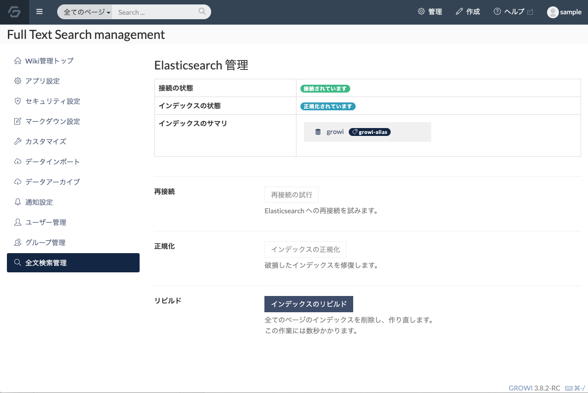
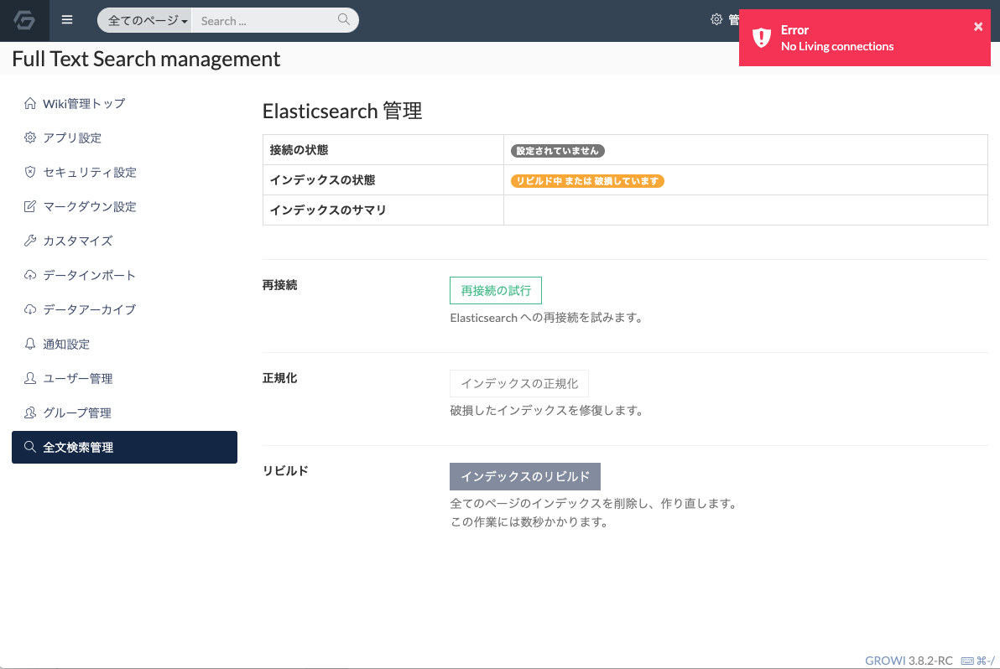

# 検索機能のセットアップ

Elasticsearch による全文検索機能を利用するための設定方法を紹介します。

## 各環境における Elasticsearch の起動と接続
- docker-compose
  - [weseek/growi-docker-compose](https://github.com/weseek/growi-docker-compose) を利用している場合はデフォルトで Elasticsearch が起動されるので、追加で設定する必要はありません。
- ubuntu
  - [こちら](../getting-started/ubuntu-server.html#elasticsearch)を参考にインストールおよび起動してください。
  - 起動した Elasticsearch の URI を GROWI の環境変数 `ELASTICSEARCH_URI` に設定してください。
- centOS
  - [こちら](../getting-started/centos.html#elasticsearch)を参考にインストールおよび起動してください。
  - 起動した Elasticsearch の URI を GROWI の環境変数 `ELASTICSEARCH_URI` に設定してください。
- Heroku
  - (TBD)

## アプリ上で接続確認
- 環境変数 `ELASTICSEARCH_URI` によって Elasticsearch の URI が指定され、正常に接続されている場合、GROWI 画面のトップバーに検索窓が表示され、管理画面の全文検索管理ページにて接続および Elasticsearch インデックスの状態を確認することができます。

  

- Elasticsearch の URI が指定されているにもかかわらず以下のような接続が確認できない旨のエラーが表示される場合は Elasticsearch の状態と URI の設定を見直してください。

  

## インデックスの正規化またはリビルト
Elasticsearch による検索機能は、検索用 DB のデータと Mongo DB に存在するデータの整合が取れていることを前提として正常な検索機能を実現します。そのため DB を直接操作するなどの行為によりこれらの DB 間で不整合が起きた場合、検索機能が正常に動作しません。

そのような場合に、管理画面の全文検索管理ページにて修復またはインデックスのリビルドを行うことがで検索機能を正常に動作させることができます。

### インデックスの正規化
破損しているインデックスを修復します。全文検索管理ページの[インデックスの正規化]ボタンにて実行します。この操作はインデックスの状態が破損状態の時のみ実行可能です。

### インデックスのリビルド
インデックスを作り直します。全文検索管理ページの[インデックスのリビルド]ボタンにて実行します。この操作はインデックスが正規化されている時のみ実行可能です。
  

