# Slack 連携

## 概要

  GROWI では、 Slack 連携の方法として、1. GROWI bot と 2. Incoming Webhook の 2 種類の方法があります。

### 1. GROWI bot

  GROWI bot は GROWI 開発チーム が開発した Slack App の一つです。任意の Slack ワークスペースにインストールすることで、
  GROWI からの通知だけでなくチャットからの全文検索実行や会話まとめなど様々な機能を利用することができるようになります。

#### Official bot (推奨)

  【概念図】
  

  Official GROWI bot は GROWI 開発チーム が無償で提供・運用している GROWI bot です。
  [slack app directory](https://wsgrowi.slack.com/apps) で公開されており、どなたでも利用できます。

#### Custom bot without proxy

  【概念図】
  

  Custom bot without proxy は Slack bot を作成し、お使いの GROWI と紐付けを行うことで、
  Slack から GROWI の 機能の一部を使用することができます。

#### Custom bot with proxy

  【概念図】
  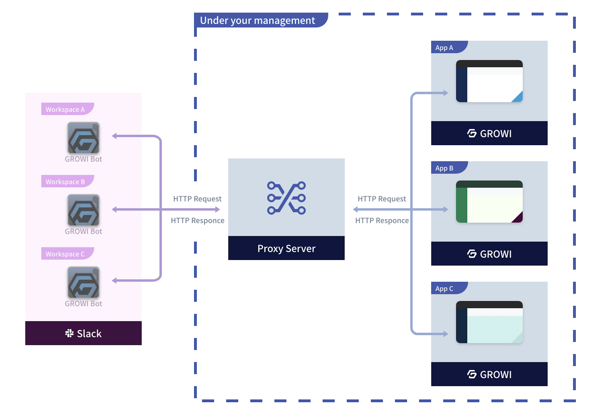

  Custom bot with proxy は Slack bot を作成し、proxy サーバーを立ち上げ・設定することで、
  Official bot と同様の手順で GROWI の機能の一部を使用することができます。

### 2. Incoming Webhook

  Incoming Webhook も Slack 連携を行う手段の一つですが、GROWI bot とは異なり、Slack への通知に特化しています。
  チャットからの全文検索など GROWI bot にある機能の多くは使うことができませんが、その分簡単にセットアップできます。詳しくは[通知の種類/設定方法](/ja/admin-guide/management-cookbook/external-notification.html#通知の種類-設定方法)をご覧ください。

## Official bot 設定

### BotTypeの選択

  管理画面の Slack 連携 にて **Official bot** を選択してください。

  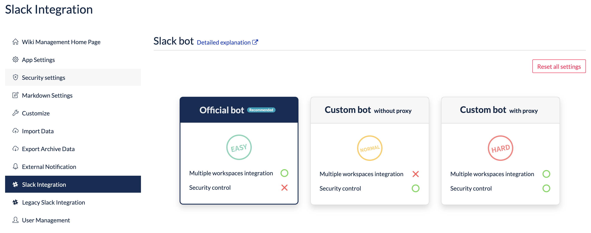

### Official bot を Slack のワークスペースへインストールする

  1. **Slack ワークスペースを追加** ボタンをクリックします。

      

  1. **Integration Procedure** に新規のアコーディオンが生成されるので、①「Instal Bot to Slack」のタブをクリックして開きます。
  1. **Install now** ボタンをクリックします。

      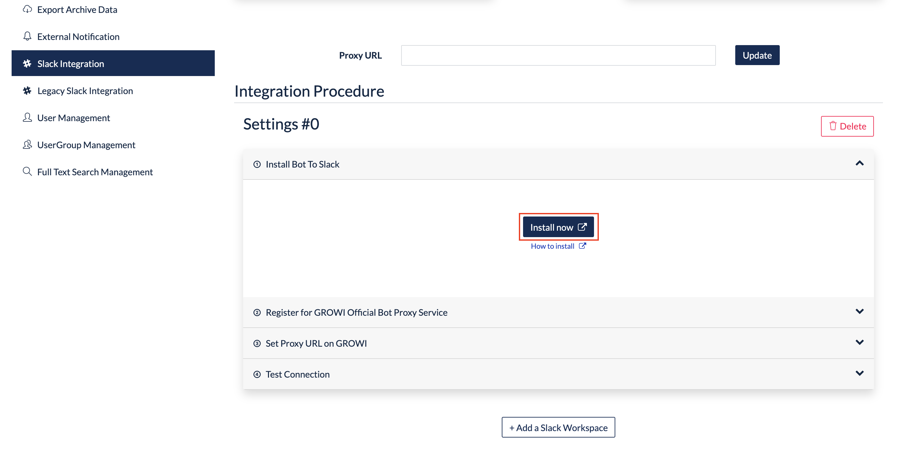

  1. Slack app directory のリンクに飛ぶので、「Add to Slack」ボタンを押して自身の Slack work space にインストールします。
    <!-- TODO: GW-6420 [Official] app directoryの写真を挿入(GW4836 ブロック) -->

### GROWI Official Bot Proxyサービスへの登録

<!-- TODO: GW-6369 [Official]「アクセストークンの発行 / GROWI Official Bot Proxyサービスへの登録」の記述(ja) -->

### テストを実行する

1. 「Test connection」をクリックし、GROWI-Bot を招待した Slack チャンネルを入力します。
  

2. 「Test」 ボタンをクリックします。

- 成功の場合  
  **Successfully sent to Slack workspace.** が Logs に表示され、
  赤丸で囲った部分に緑色のチェックマークが表示されます。GROWI-Bot を招待した Slack チャンネルで確認してみましょう。
  - GROWI 側
    
  - Slack 側
    

<!-- TODO: GW-6441 導通テスト時の error 集を作成する -->
- 失敗の場合  
  エラーログが表示されます。ログの内容を修正してください。
  - 例  
    Channel_not_found がログに出力された場合、指定したチャンネルに GROWI-Bot を招待していないか、間違ったチャンネルを入力した可能性があります。
    GROWI-Bot が Slack チャンネルに招待されていることを確認の上、適切にチャンネル名を入力してください。　　

    

全ての設定が完了したら [GROWI bot でできること](./slack-integration.html#growi-bot-でできること)を参照してください。

## Custom bot without proxy 設定

  Custom bot without proxy を Slack のワークスペースに導入するには、Slack アプリを作成・編集する必要があります。手順は以下の通りです。

### Custom bot without proxy を作成する前に

  GROWI 本体サーバーを立ち上げてください。

### Bot type の選択

  管理画面の Slack 連携 にて **Custom bot without proxy** を選択してください。

  

### Slack app を作成する

  1. Slack API の[アプリページ](https://api.slack.com/apps)に移動し、「Create New App」をクリックします。

  

  1. 「Create a Slack App」の ①「App Name」にはアプリの名前を、②「Development Slack Workspace」には
    GROWI bot を追加したいワークスペースを選択します。

  1. 「Create App」をクリックします。

  

### スコープを設定する

  1. 作成した Slack App の **Features** から **OAuth & Permissions** をクリックします。
    
  1. **Add an OAuth Scope** をクリックします。
    
  1. **commands**, **chat:write**, **team:read** を選択します。
    以下のように表示されたら、スコープの設定は完了です。  
    

### Interactivity & Shortcuts の Request URL を設定する

  1. 作成した Slack App の **Features** から **Interactivity Shortcuts** をクリックします。
    

  1. **Interactivity** 右側にあるボタンを On にします。
    

  1. Request URL を以下のように入力してください。

- https:// 連携させたい GROWI のドメイン名 /\_api/v3/slack-integration/interactions
- 例 `https://example.com/_api/v3/slack-integration/interactions`

  

  1. 入力が完了したら、**Save Changes** をクリックしてください。

### スラッシュコマンドの作成

  1. 作成した Slack App の **Features** から **Slash Commands** をクリックします。
    

  1. **Create New Command** をクリックします。
    

      - Command に /growi と入力してください。
      - Request URL には、`https://example.com/_api/v3/slack-integration/commands` と入力してください
      - Short Description も入力必須のため、適当なご説明を入力してください。
      - Usage Hint に関しては任意なので、適宜入力してください。
      - Escape channels, users, and links sent to your app に関しては任意なので、適宜入力してください。
      - 入力が完了したら、**Save** をクリックしてください。

  

### Bot を Slack のワークスペースへインストールする

  1. 作成した Slack App の **Settings** から **Basic Information** をクリックします。
  1. **Install your app** をクリックします。
    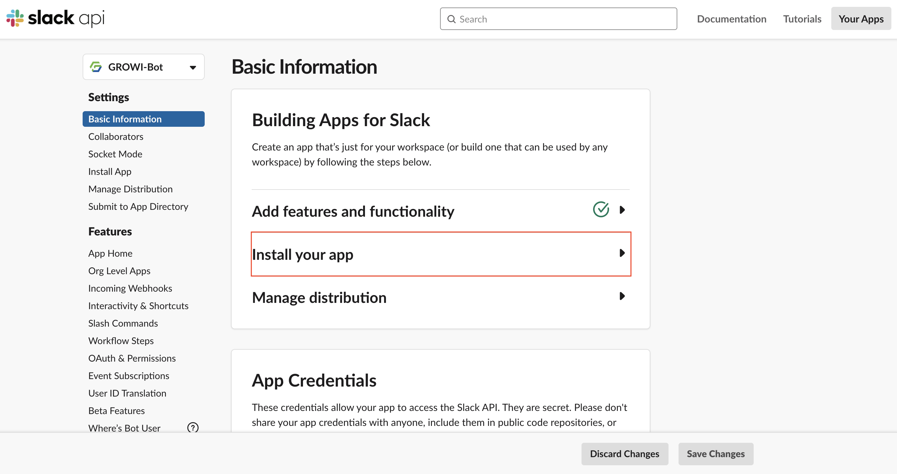
  1. **Install to Workspace** をクリックします。
    
  1. 遷移先の画面にて、**Allow**をクリックします。
    
  1. Install your app の右側に 緑色のチェックがつけばワークスペースへのインストール完了です。
    
  1. GROWI bot を使いたいチャンネルに @example を使用して招待します。
    
    

### Signing Secret と Bot User OAuth Token の設定

  Signing Secret と Bot User OAuth Token の設定を行う前に、作成した Bot でそれぞれの値を確認します。

#### Signing Secret の確認方法

1. 作成した Slack App の **Settings** から **Basic Information** をクリックします。
   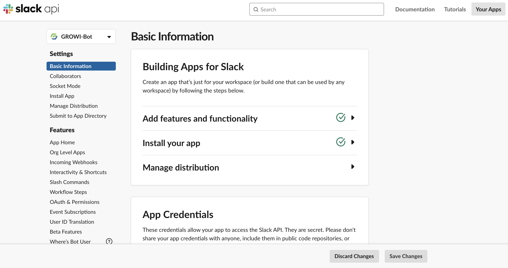

1. App Credentials の **Signing Secret** の **show** ボタンを押して確認します。
   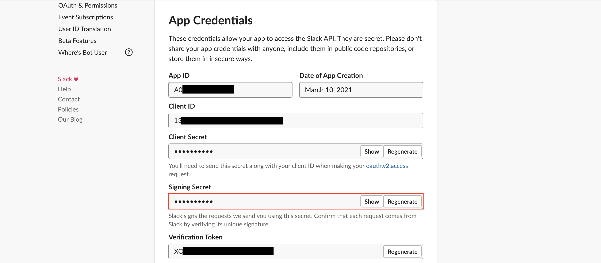

#### Bot User OAuth Token の確認方法

1. 作成した Slack App の **Settings** から **OAuth and Permissions** をクリックします。
   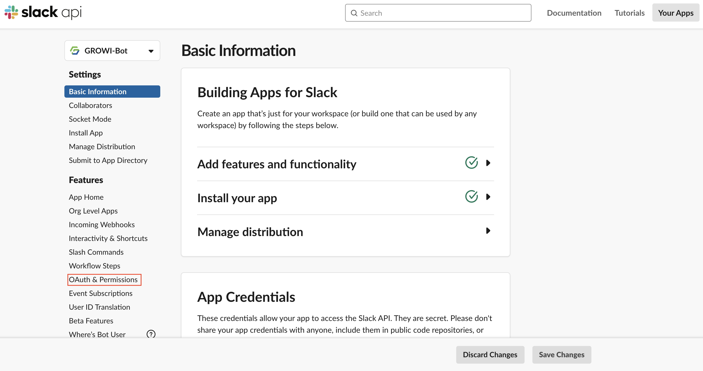

1. **OAuth Tokens for Your Team** の **Bot User Oauth Token** から確認します。
   

  確認した **Signing Secret** と **Bot User OAuth Token** は 1. 管理画面で入力して設定する方法 と 2. 環境変数で設定する方法の
  2 種類の方法があります。管理画面で直接入力する方が容易です。
  また、環境変数と管理画面の両方に入力した場合は、管理画面で入力した値が優先されるので、管理画面での入力をおすすめします。

1. 管理画面で直接入力する方法

- 管理画面の Slack 連携をクリックし、**Signing Secret** と **Bot User OAuth Token** を入力して
   **Update** ボタンをクリックします。
  
- 赤丸で囲った部分に緑色のチェックマークが表示されたら登録完了です。
    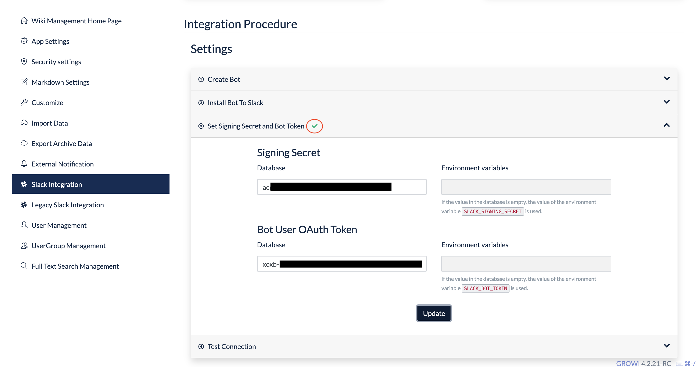

1. 環境変数で設定する方法

  環境変数 `SLACK_SIGNING_SECRET` と `SLACK_BOT_TOKEN` に確認した値を代入してください。

#### 導通テスト

1. 「Test connection」をクリックし、GROWI-Bot を招待した Slack チャンネルを入力します。
  

2. 「Test」 ボタンをクリックします。

- 成功の場合  
  **Successfully sent to Slack workspace.** が Logs に表示され、赤丸で囲った部分に緑色のチェックマークが表示されます。GROWI-Bot を招待した Slack チャンネルで確認してみましょう。
  - GROWI 側
      
  - Slack 側
      

- 失敗の場合  
  エラーログが表示されます。ログの内容を修正してください。
  - 例  
    Channel_not_found がログに出力された場合、指定したチャンネルに GROWI-Bot を招待していないか、間違ったチャンネルを入力した可能性があります。GROWI-Bot が Slack チャンネルに招待されていることを確認の上、適切にチャンネル名を入力してください。　　

    

## Custom bot with proxy 設定

  Custom bot with proxy を Slack のワークスペースに導入するには、Slack アプリを作成・編集する必要があります。手順は以下の通りです。

### Custom bot with proxy を作成する前に

  1. `packages/slackbot-proxy` の配下に 新規ファイル`.env.development.local`を作成します。
  1. 1で作成したファイルに任意の環境変数`SERVER_URI`を入力してください。

  例: `SERVER_URI=http://localhost:8080`

  1. GROWI 本体サーバーとプロキシ用サーバー(`slackbot-proxy`)の両方を立ち上げてください。  
    プロキシ用サーバーは`yarn`, `yarn dev`で起動することができます。

  1. 管理画面の Slack 連携 にて **Custom bot with proxy** を選択してください。

  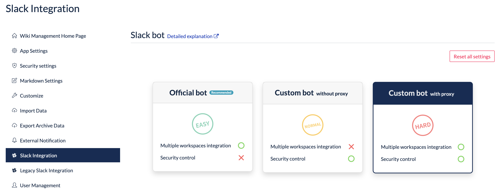

### Custom bot with proxy を作成する

1. Slack API の[アプリページ](https://api.slack.com/apps)に移動し、「Create New App」をクリックします。

   

1. 「Create a Slack App」の ①「App Name」にはアプリの名前を、②「Development Slack Workspace」には
   GROWI bot を追加したいワークスペースを選択します。

1. 「Create App」をクリックします。

   

### Custom bot with proxy のスコープを設定する

1. 作成した Slack App の **Features** から **OAuth & Permissions** をクリックします。
  
1. **Add an OAuth Scope** をクリックします。
  
1. **commands**, **chat:write**, **team:read** を選択します。
  以下のように表示されたら、スコープの設定は完了です。
  

### Request URL 設定

#### Interactivity & Shortcuts

  1. 作成した Slack App の **Features** から **Interactivity Shortcuts** をクリックします。
    

  1. **Interactivity** 右側にあるボタンを On にします。
    

  1. Request URL を以下のように入力してください。

- https:// 連携させたい PROXY のドメイン名 /slack/interactions
  - 例 `https://example.com/slack/interactions`

      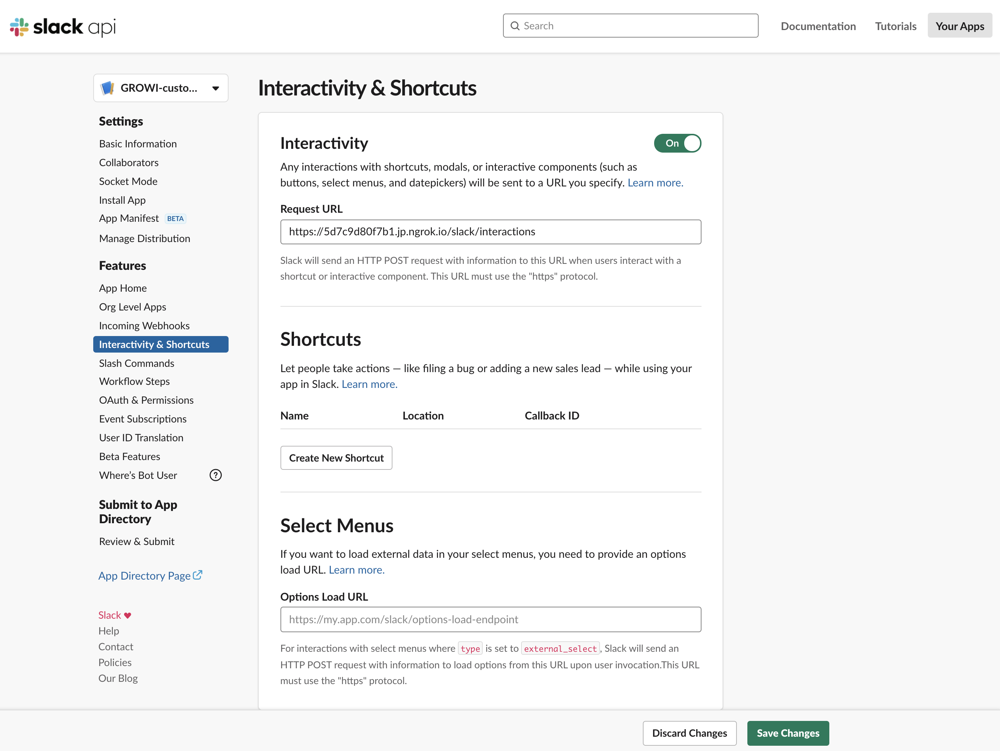

    1. 入力が完了したら、**Save Changes** をクリックしてください。

#### Slash Commands

  1. 作成した Slack App の **Features** から **Slash Commands** をクリックします。
    

  1. **Create New Command** をクリックします。
    

      - Command に /growi と入力してください。
      - Request URL には、`https://example.com/slack/commands` と入力してください
      - Short Description も入力必須のため、適当なご説明を入力してください。
      - Usage Hint に関しては任意なので、適宜入力してください。
      - Escape channels, users, and links sent to your app に関しては任意なので、適宜入力してください。
      - 入力が完了したら、**Save** をクリックしてください。

  

### Redirect URL 設定

#### OAuth & Permissions

  1. 作成した Slack App の **Features** から **OAuth & Permissions** をクリックします。
  1. **Redirect URLs** の **Add New Redirect URL** ボタンをクリックします。
    

  1. 入力欄が表示されるので、`https://example.com/slack/oauth_redirect` と入力してください。
    

  1. 入力したら **Add** ボタン をクリックしてください。
  

### Manage Distribution を設定する
<!-- TODO: GW-6329 [Custom bot with proxy]「Manage Distribution を設定する」を記述する(ja)) -->

### Custom bot with proxy を Slack のワークスペースへインストールする

  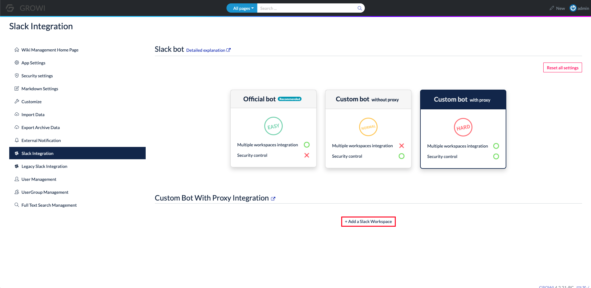

  1. **Slack ワークスペースを追加** ボタンを押します。  
    ボタンを押すと連携手順に新規のアコーディオンが生成されます。
  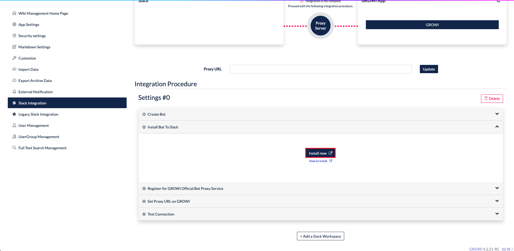
  1. Bot を Slack にインストールする を開き、**今すぐインストール** ボタンを押して、 Official bot をワークスペースにインストールします。

### GROWI Custom Bot with Proxy サービスへの登録
  
  1. GROWI Official Bot Proxy サービスへの登録を開きます。  
    **Access Token の発行** に各種トークンにアクセストークンが2種生成されていることを確認できます。
    アクセストークンは必要に応じて再発行できます。
  1. Slack上で `/growi register` と打ちます。

  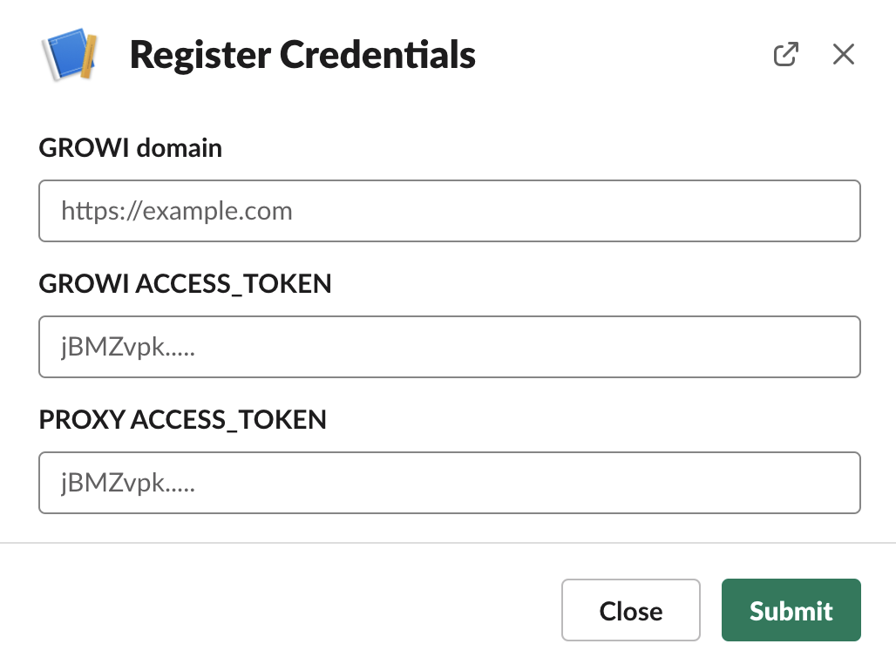
  
  1. 表示されるモーダルの GROWI URL に、対象 GROWI の URL を保存します。
  1. 上記で発行されている Access Token Proxy to GROWI と Access Token GROWI to Proxy を入れ **Submit** ボタンを押します。

  

  成功した場合、 Proxy サーバーの URL が表示されます。

  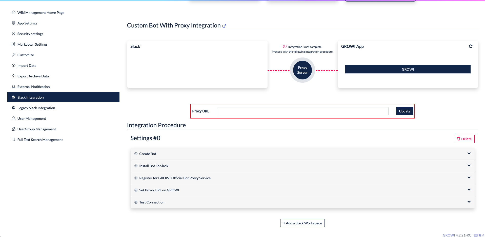

  上記で取得した Proxy サーバーの URL を **Official bot 連携** の Proxy URL に入力し更新します。

### テストを実行する
<!-- TODO: GW-6328 [Custom bot with proxy]「テストを実行する」の記述(ja) -->

全ての設定が完了したら [GROWI bot でできること](./slack-integration.html#growi-bot-でできること)を参照してください。

## GROWI bot でできること

### ワークスペース内の全文検索

1. /growi search [keyword(s)] を入力すると検索結果が表示されます。

   - 例: /growi search example
     
   - 検索結果
     
   - **Next** ボタンをクリックすると、次の検索結果を表示します。
     
   - **Share** ボタンをクリックすると、チャンネル内に共有されます。
     

### 接続中の GROWI を確認する

`/growi status` と入力することで、Slack ワークスペースと連携している GROWI を確認することができます。(※ Bot type が Official bot と Custom bot with proxy の場合のみ使えます。)

<!-- ### 複数ワークスペースの横断検索 (TBD) -->

<!-- ### Slack ログの記録 (TBD) -->

### Slack ワークスペースと GROWI App(s) との連携を解除する

1. `/growi unregister [連携解除したい GROWI App の URL1] [連携解除したい GROWI App の URL2] ...` と入力するとモーダルが表示されます。

    - 入力例: `growi unregister http://example.com http://growi.jp`
    

    - 表示されるモーダル
    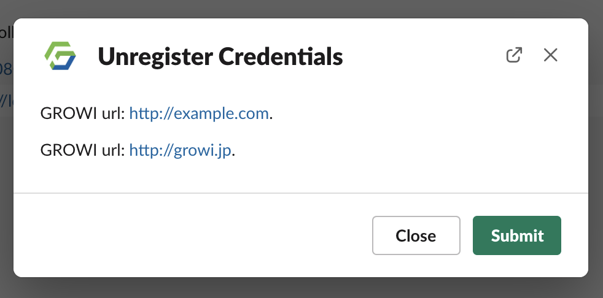
1. **Submit** ボタンをクリックします。
1. 以下のように表示されたら、連携解除が完了しています。
    

## Incoming webhook 設定

<!-- TODO: GW-5372 「Slack/Mattermost への通知」の内容を適切なタイトルの下に移動させる -->

  通知を行う Slack ワークスペースを設定します。

  1. 管理画面のセキュリティ設定ページ(/admin/notification)にアクセスします。
  2. Slack Incoming Webhooks 設定の必要事項を入力し、更新ボタンを押します。

      - **Webhook URL**  
      [Incoming Webhooks](https://slack.com/services/new/incoming-webhook) で取得できます。

### 設定が反映されているかの確認

  上記の設定後、ページの編集モード画面に Slack 通知フォームが追加されます。

  

  ページの保存・更新時に 入力したチャンネルに Slack 通知が届きます。  
  この方法で通知を行うことを GROWI では **User Trigger Notification** といいます。

  User Trigger Notification の設定方法は[こちら](../management-cookbook/external-notification.html#user-trigger-notification-設定)を参照してください。
